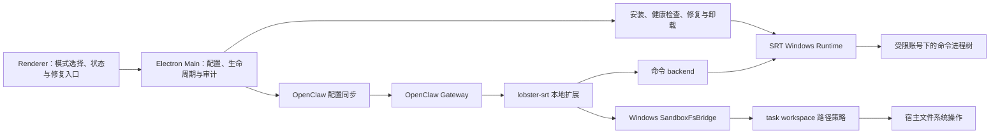

# Windows 原生沙箱分阶段实施计划

- 日期：2026-07-16
- 状态：M1、M1.4 与 M2 已实现；M1 仍待 Windows 人工安装/安装包签名验收，M2 的真实 backend 保持硬关闭
- 首期平台：Windows
- 运行时基线：`@anthropic-ai/sandbox-runtime` `0.0.65`（精确锁定）
- 核心取舍：支持多任务 workspace 并发，接受 Windows 沙箱账号对这些 workspace 的权限并集

## 概述

本计划为 LobsterAI 增加一个不依赖 Docker 的 Windows 原生沙箱执行模式。新模式复用现有 OpenClaw Agent 运行链路，通过 LobsterAI 本地扩展注册沙箱 backend，并使用 SRT 的 Windows 原生能力约束命令进程树的文件与网络访问。

首期目标不是一次性替换当前实机执行，而是建立一条可独立启用、可诊断、可回退、默认不改变现有行为的新执行路径。实施按阶段推进：前几个阶段只建立接口、打包、诊断和兼容基础，随后接入单 workspace，验证稳定后再开放多 workspace 并发和产品入口。

Windows 首期采用一个共享的 `srt-sandbox` 本地账号。多个并发 workspace 被授权后，该账号获得这些目录权限的并集。因此，本方案提供的是“已授权 workspace 集合与电脑其余区域之间”的 OS 级边界，不承诺并发 workspace 彼此之间的 OS 级隔离。

macOS 本期不实现实际沙箱能力，只预留平台 backend 接口、能力检测和资源解析入口，避免 Windows 逻辑散落到业务层。后续增加 macOS backend 时，不应重写会话、配置、审计和 UI 主流程。

## 背景与术语

### Agent workspace

OpenClaw 持久化 Agent 身份、记忆和工作指令的目录，例如 `workspace-main` 或 `workspace-{agentId}`。它不等同于用户当前选择的项目目录，并且在本方案中继续保持原有职责。

### Task workspace

一次 LobsterAI 会话实际工作的目录，即会话 `cwd`。文件读取、修改和命令执行应以此目录为当前任务根目录。本文没有特别说明时，`workspace` 均指 task workspace。

### 实机模式

当前未启用新沙箱 backend 的执行方式。命令和文件工具保持现有 OpenClaw/LobsterAI 行为。

### 权限并集

若会话 A 授权 `D:\project-a`，会话 B 授权 `D:\project-b`，且两者同时使用共享的 Windows 沙箱账号，则该账号在 OS 层可访问 `project-a ∪ project-b`。即使每个会话在产品层仍绑定自己的 `cwd`，由命令启动的进程也可能访问并集中的另一目录。

## 用户场景

### 场景一：继续使用现有实机模式

用户没有启用 Windows 原生沙箱，或灰度开关尚未开放。LobsterAI 的命令执行、文件读写、会话恢复、上下文压缩、Agent 记忆和工作目录行为均与当前版本一致；应用启动时不检查安装、不创建系统账号，也不弹出 UAC。

### 场景二：单 workspace 沙箱任务

用户在 `D:\github\project-a` 开启沙箱会话。Agent 可以在该目录内读取和修改文件，可以运行 `npm test` 及其子进程；尝试读取 `C:\Users\<user>\Documents\private.txt` 或写入其他未授权目录时应被拒绝。若沙箱初始化失败，任务明确失败并给出修复入口，不静默切回实机执行。

### 场景三：多 workspace 并发

用户同时运行两个会话：

- 会话 A 的 `cwd` 为 `D:\github\project-a`；
- 会话 B 的 `cwd` 为 `D:\github\project-b`。

两者可以并发运行，无需为了目录授权而全局串行。产品层文件工具仍各自限制在本会话的 task workspace；但命令进程树使用同一个 Windows 沙箱账号，因此 OS 级可见范围为 A、B 两个目录的权限并集。并集以外的目录仍不可访问。

### 场景四：首次安装与修复

用户首次选择沙箱模式时，LobsterAI 展示用途与权限说明，再按需触发一次需要管理员授权的安装。用户取消 UAC、安装中断或状态不完整时，现有实机模式不受影响；沙箱任务保持不可执行，直到诊断或修复成功。

### 场景五：升级与卸载

应用升级不得无故删除已经建立的沙箱系统状态。正式卸载时，在应用资源尚可用的阶段尝试清理沙箱账号、网络规则和 LobsterAI 建立的目录授权；清理失败要留下可操作的提示，但不能使应用永久无法卸载。

## 目标

1. Windows 上提供无需 Docker 的 task workspace 读写边界。
2. 命令及其子进程必须经过 SRT 启动，不能仅依靠工具调用前的字符串判断。
3. OpenClaw 文件工具必须经过 task workspace 根路径校验，不能因 Gateway 自身拥有宿主权限而绕过边界。
4. 支持多个不同 task workspace 的会话并发，并明确采用共享账号权限并集语义。
5. 未启用沙箱时，现有实机行为、配置和启动链路保持不变。
6. 用户明确选择沙箱后采用 fail-closed：沙箱不可用时拒绝执行，不自动降级为实机。
7. 提供安装、状态检测、修复、升级和卸载的完整生命周期。
8. 提供可关联会话、工具调用、策略版本和执行结果的本地结构化审计事件。
9. 预留 macOS backend 接口和能力状态，不在本期交付 macOS 沙箱实现。

## 非目标

1. 不提供并发 task workspace 之间的 OS 级强隔离。
2. 不在首期引入容器或虚拟机运行环境。
3. 不改变 Agent workspace 的记忆、身份和指令持久化职责。
4. 不在首期沙箱化 Electron Renderer、主进程或 OpenClaw Gateway 本身。
5. 不承诺自动约束绕过 OpenClaw 工具系统的外部程序、独立 MCP 服务或浏览器自动化进程；这些能力需分别确定进程归属和边界。
6. 不在首期实现内核级全量文件 I/O 审计、集中式审计平台或防篡改远端日志。
7. 不在首期新增“命令是否危险”的智能分类器。审批策略与 OS 强制边界是两层不同能力，可在后续独立演进。
8. 不在本期交付 macOS、Linux 或 Windows ARM64 的正式可用承诺；若现有发布矩阵包含这些目标，必须显示为不支持或单独通过发布门槛。
9. 测试版不追求最终设置页信息架构，也不增加按 Agent、按会话或按 workspace 的独立开关；正式入口后续统一重新整合。

## 核心设计决策

### 1. 集成边界

采用以下组合：

- LobsterAI 主进程负责产品配置、SRT 安装/诊断/修复、IPC 和用户交互；
- LobsterAI 本地 OpenClaw 扩展负责注册 `lobster-srt` sandbox backend；
- SRT 负责 Windows 沙箱账号、命令进程树、文件 ACL 和网络出口边界；
- 一个最小的固定版本 OpenClaw 补丁负责解决“持久 Agent workspace 与独立 task cwd 共存”及系统提示词中的路径语义；
- 自定义 Windows `SandboxFsBridge` 负责 OpenClaw 文件工具的 task workspace 路径约束。

backend 注册、命令包装和文件桥接均使用现有插件扩展点，不放入 OpenClaw 核心补丁。补丁只覆盖当前扩展点无法表达的 task cwd 兼容问题，并随固定 OpenClaw 版本存放。

### 2. 两条工具执行路径

LLM 返回的 tool call 不需要被转换成 SRT 专有的“编辑文件参数”。OpenClaw 先按现有逻辑选择工具，然后由工具类型进入不同执行路径：

- `exec`/shell：backend 将原命令和执行上下文交给 SRT，由 SRT 在受限 Windows 账号下启动完整进程树；
- `read`/`write`/`edit`/`apply_patch`：通过自定义 `SandboxFsBridge` 校验并解析路径，再由桥接层执行文件操作。

SRT 只能约束由它启动的进程，无法约束仍运行在宿主账号下的 OpenClaw Gateway 直接访问文件。因此，自定义文件桥不是可选优化，而是文件工具安全边界的一部分。

### 3. 产品层限制与 OS 层限制

本方案明确保留两层不同粒度：

- 产品层：每个会话的文件工具只允许访问自己的 task workspace；
- OS 层：所有同时授权给共享沙箱账号的 workspace 构成权限并集，命令进程树可访问该并集。

这意味着在场景 A、B 并发时，A 会话的 `write` 工具不能指定 B 的路径，但 A 的 shell 命令可能访问 B。UI、帮助信息、审计记录和验收用例必须明确这一点，不能将其描述为 session 级安全隔离。

### 4. 默认关闭与失败关闭

依赖存在、扩展加载或 SRT 已安装，均不代表自动启用沙箱。只有明确的产品设置和能力检查同时满足时，配置同步才选择 `lobster-srt` backend。

- 未启用：继续走实机模式；
- 已启用且健康：走 Windows 原生沙箱；
- 已启用但缺失、损坏或平台不支持：拒绝执行并提示诊断/修复；
- 不允许在最后一种情况下静默回退实机。

### 5. 状态真值

Windows 实际存在的本地账号、文件 ACL、WFP 规则及其行为验证是系统安全状态的最终真值。SRT 自有状态数据库只作为 SRT 的持久协调状态，记录安装标记、加密材料和 ACL 引用计数等信息；健康检查与崩溃恢复必须核对数据库记录和 Windows 实际状态，不能只信任任意一方。

LobsterAI 不复制 SRT 数据库中的密钥或敏感状态，也不维护另一个“已安装”布尔真值。

LobsterAI 自身只保存：

- 用户选择的执行模式；
- 最近一次诊断结果和时间；
- 最近检测到的 SRT 版本；
- 是否需要显示安装或修复提示；
- 非敏感的策略版本与审计元数据。

## 总体架构



### 代码组织与依赖边界

沙箱功能按运行边界分别收口在同名的 `nativeSandbox` 二级目录中，而不是把 Main、Renderer、Shared 和 OpenClaw 代码物理混放在一个目录。各目录职责与允许依赖如下：

```text
src/shared/nativeSandbox/
  constants.ts
  types.ts
  api.ts

src/main/nativeSandbox/
  index.ts
  nativeSandboxModule.ts
  nativeSandboxIpcHandlers.ts
  nativeSandboxService.ts
  nativeSandboxEnvironment.ts
  srtWindowsRuntime.ts

src/renderer/components/settings/nativeSandbox/
  index.ts
  SandboxSettingsSection.tsx
  useNativeSandboxController.ts
  NativeSandboxStatusCard.tsx
  nativeSandboxViewModel.ts
  translations.ts

openclaw-extensions/lobster-srt-sandbox/
  index.ts
  src/backend/
  src/runtime/
  src/fs/
  src/workspace/
  src/audit/
  src/config/

scripts/native-sandbox/
  verify-package.cjs
```

- `shared/nativeSandbox` 只包含跨进程常量、DTO 和 preload API 契约，不依赖 Electron、SRT、Renderer 或 OpenClaw。
- `main/nativeSandbox` 拥有平台能力、SRT 生命周期、资源解析、IPC 注册和后续启停事务；它可以依赖 shared 契约，但不能依赖 Renderer 组件或 OpenClaw 扩展源码。
- Renderer 领域目录只通过 preload 契约调用 Main，不导入 SRT、Node.js 或 OpenClaw 配置实现；异步状态和展示映射从大型设置组件中移出。
- OpenClaw extension 拥有执行 backend、文件桥、workspace lease 和执行侧审计事件生产；它不直接读写 LobsterAI SQLite，也不承担设置页状态管理。
- 构建脚本放在 `scripts/native-sandbox/`，只校验依赖、资源和产物，不承载运行时业务状态。

中央文件只保留最小接入点：`main.ts` 一次注册领域模块，`preload.ts` 暴露一组安全桥，`Settings.tsx` 注册 Tab，i18n 文件聚合领域文案，OpenClaw 配置同步调用纯映射函数，electron-builder hook 调用领域校验器。后续功能不得把生命周期编排、错误映射、loading 状态、路径策略或审计持久化继续堆入这些中央文件。

### 与早期抽象架构的对应关系

整体调用方向不变，但组件职责更明确，并减少了需要自研和维护的本地可执行程序：

| 早期抽象节点 | 当前方案 | 主要变化 |
| --- | --- | --- |
| Lobster UI / 配置 | `Sandbox（测试）` Tab + Electron Main 生命周期服务 | Renderer 不直接写 OpenClaw 配置；主进程负责校验、安装、持久化和配置同步 |
| `openclaw.json` | 仍作为生成的 OpenClaw 配置 | 它是配置同步结果，不是 UI 直接编辑的状态源 |
| Lobster Native Sandbox 插件 | `lobster-srt` 本地 OpenClaw extension/backend | 这一层保留，负责接入 OpenClaw 工具和 SRT |
| `lobster-sandbox-service` | 主进程生命周期服务 + extension 内运行时协调器 | 不新增独立常驻 service 进程，减少安装、升级、IPC 和崩溃恢复成本 |
| `lobster-sandbox-setup.exe` | SRT JavaScript API + 独立资源 `srt-win.exe` | 使用固定版本 SRT 完成账号、ACL 和 WFP 生命周期，不另写一套 setup 程序 |
| `lobster-command-runner.exe` | SRT backend 调用 `srt-win.exe` 启动受限进程树 | 不另写命令 runner；PowerShell、npm、Python 及子进程由 SRT 统一启动 |
| OpenClaw exec / read / write 共用一路 | exec 走 SRT；read/write/edit 走自定义 `SandboxFsBridge` | SRT 只能约束它启动的进程，因此宿主 Gateway 的文件工具必须有独立路径边界 |

当前方案还比早期抽象图多出三个必要概念：Agent workspace 与 task workspace 的双根语义、多 workspace 的共享权限并集协调，以及健康检查/fail-closed/审计。它们不会改变主调用方向，但决定该链路是否能安全落地和稳定恢复。

### 配置流

1. Renderer 的测试版设置 Tab 只通过 preload 暴露的 IPC 读取能力、触发安装/修复和修改模式，不直接写 `openclaw.json`。
2. 主进程验证平台与健康状态，将产品模式映射到 OpenClaw sandbox 配置。
3. 测试开关是 LobsterAI 全局开关。启用时目标配置为 session 级运行上下文、读写 task workspace、选择 `lobster-srt` backend，并禁用不在本期范围内的 browser sandbox。
4. sandbox backend 或插件启用状态发生变化时，配置影响判定为需要 Gateway restart，而不是仅同步热配置。
5. Gateway 重启后由本地扩展注册 backend；扩展没有被选择时不得改变实机执行链路。

M3 开放测试开关时，Renderer 不再自行组合状态检查、配置写入和 Gateway 重启，而是调用领域专用的 `native-sandbox:set-enabled`。Main 在单一互斥事务中依次执行“任务空闲检查 → 平台与健康检查 → 持久化目标配置 → 同步 OpenClaw 配置 → 重启 Gateway → 校验 backend 状态”。任一步骤失败都返回结构化阶段和错误码，并补偿恢复此前配置；恢复未完成时保持 fail-closed 并显示可修复状态，不能出现 UI 显示已启用而实际仍走实机的中间态。

### 测试版设置入口

LobsterAI 设置页新增一个独立的 `Sandbox（测试）` Tab。它只是当前开发和验证入口，后续可以重新整合进正式的权限或执行模式设计，本期不为临时页面建设复杂的信息架构。

测试开关使用独立的 Cowork 全局配置 `nativeSandboxEnabled: boolean`，默认值为 `false`。它不复用或改写现有 `executionMode`，避免与当前企业执行模式及既有配置兼容逻辑混在一起。字段仍可存入 `cowork_config`，但 M3 开放开关后 Renderer 不直接通过通用 Cowork config IPC 写入，而是调用领域专用 `native-sandbox:set-enabled`，由主进程完成健康检查、持久化、OpenClaw 配置同步、Gateway 重启和失败补偿。

当 `nativeSandboxEnabled` 为 `false` 时，配置同步必须完整保留现有 sandbox 映射行为；只有该字段为 `true`、测试功能已开放且 Windows 健康检查通过时，才覆盖为 `lobster-srt` backend。若当前环境的执行模式由企业配置管理，则测试开关隐藏或禁用，不覆盖受管策略。

页面只包含以下必要内容：

- 一个全局“启用 Sandbox”开关；
- 当前能力/健康状态和固定 SRT 版本；
- 一个随状态变化的“安装”或“修复”按钮；
- 简短说明：仅支持 Windows、切换会重启 Gateway、多 workspace 使用共享权限并集；
- 最近一次错误及可复制的非敏感诊断摘要。

开关行为固定为：

1. 打开时先检查能力和健康状态；未安装则在用户确认后触发 UAC 安装。
2. 只有完整健康检查通过后才持久化启用状态、同步 OpenClaw 配置并重启 Gateway；用户取消或安装失败时开关保持关闭。
3. 已处于启用状态但运行时随后降级时，开关仍显示已启用/异常，新的沙箱任务 fail-closed，并提供修复按钮。
4. 关闭时同步 sandbox `off` 并重启 Gateway，但不卸载 SRT、不删除系统账号或网络规则。
5. 有任务正在执行时不做热切换；测试版要求等待任务结束后再切换，并给出简单提示。
6. 测试版不提供每个 session 的覆盖值、高级网络规则、workspace 列表管理或审计导出。

### task cwd 与 Agent workspace

OpenClaw 当前在沙箱开启时会拒绝与持久 workspace 不同的 task cwd，普通执行和上下文压缩链路均存在该限制。本方案使用最小版本补丁实现：

- 在 sandbox context 和相关调用链中显式区分 `agentWorkspaceDir` 与 `taskWorkspaceDir`，不能只删除现有 cwd guard；
- 保留 `agentWorkspaceDir` 作为记忆、身份、启动文件和持久上下文目录；
- 接受 LobsterAI 会话传入的 `taskWorkspaceDir`；
- `workspaceAccess`、shell cwd 和 coding/file 工具根目录均绑定 `taskWorkspaceDir`，不能继续隐式绑定 Agent workspace；
- Agent workspace 的 bootstrap、记忆读取和持久化继续由既有 Gateway 内部链路处理，不自动暴露给任务命令或通用文件桥；若现有记忆写入依赖 coding/file 工具，则在实施时迁移为专用内部记忆操作或明确、最小的内部桥，不能通过放宽 task workspace 根来兼容；
- 上下文压缩使用相同路径规则，不因压缩阶段重新落回 Agent workspace；
- 系统提示词展示真实 Windows task cwd，不输出容器专用路径或命令提示。

## Windows 文件路径策略

自定义 `SandboxFsBridge` 至少支持 OpenClaw 当前使用的 `resolve`、`read`、`write`、`mkdir`、`remove`、`rename` 和 `stat` 语义，并遵守以下规则：

1. 所有相对路径以当前会话 task workspace 为根。
2. 拒绝指向根目录以外的绝对路径和 `..` 穿越。
3. 路径比较采用 Windows 大小写不敏感语义，不能只做字符串前缀比较。
4. 先规范化盘符、分隔符和最终路径，再进行根包含判断。
5. 对 junction、symlink、reparse point 和 hard link 设计专门测试；无法证明安全的类型在首期拒绝或标记为不支持。
6. 默认拒绝直接授权盘符根目录、用户 profile 根目录、Windows 系统目录等过宽根路径。
7. 对嵌套 workspace 去重，例如授权 `D:\repo` 后不重复扩大为另一条等价路径。
8. 写入和重命名在工具协议要求时保持原子性，失败不能留下越界临时文件。
9. skill、运行时或工具链所需的额外只读目录必须通过显式、最小化的 read roots 提供，不能直接放开整个用户目录。
10. workspace 内的路径在检查后到实际操作前发生替换的竞态必须纳入测试；无法消除时采用句柄级校验或拒绝高风险操作。

## 多 workspace 权限并集与并发模型

### 并集形成

Windows backend 使用共享沙箱账号。每个准备执行的 sandbox session 向运行时协调器登记规范化后的 task workspace，并获取一个 lease。实际 OS 权限等于当前已建立授权的 workspace 集合并集。

### 协调规则

1. 新增 workspace、建立 ACL、创建或销毁 SRT session 必须经过进程内全局协调锁，避免重复安装或引用计数竞态。
2. SRT `0.0.65` 是否支持在既有命令运行时安全扩大 allow roots，必须先以原型和 Windows 行为测试证明，不能作为前置假设。
3. 若验证支持在线扩容，协调锁只保护权限集合变更，不包围命令整个运行期；权限准备完成后，不同会话命令可以并发。
4. 若验证不支持在线扩容，则集合变更采用 quiesce/rebuild：暂停接收新的 sandbox exec，等待活动任务归零，重建包含新 workspace 的运行时权限集合，再恢复执行。该模式仍支持集合稳定后的多 workspace 并发，但不承诺新增 workspace 时无等待。
5. 相同 workspace 的多个会话共享规范化根记录并使用引用计数。
6. 扩大并集必须在新 workspace 第一次命令执行前完成。
7. 任何 workspace 仍有活动进程时不得撤销其权限。
8. 首期若无法可靠地在线缩小权限并集，则将删除标记为 pending，并在无活动任务的维护窗口或 Gateway 重启时统一协调清理；UI 和审计需显示该状态。
9. Gateway 异常退出后，下次启动必须先做状态核对和遗留授权协调，再允许新的沙箱任务运行。
10. 不将内存引用计数或 SRT 数据库单独视为 Windows 安全状态真值；崩溃恢复必须同时核对 SRT 持久协调状态和实际系统状态。

### 明确的安全语义

多 workspace 并发是可用性能力，不是隔离域数量的增加。只要 A、B 同时处于授权集合，任一受限命令进程理论上都可访问 A、B。安全边界仍然是：

```text
允许：已授权 task workspace 的并集 + 明确配置的最小只读工具目录
拒绝：其余本机目录
```

## SRT 依赖、构建与资源交付

### 依赖方式

根 `package.json` 精确锁定 `@anthropic-ai/sandbox-runtime` `0.0.65`，不使用范围版本。JavaScript API 同时供主进程生命周期服务和本地 OpenClaw 扩展构建使用。

SRT 为 ESM-only，而 Electron main 当前编译为 CommonJS。主进程采用间接 `import()` loader，避免 TypeScript 将加载转换为 `require()`。扩展预编译时将 SRT JavaScript 依赖打入扩展产物，并检查产物中不存在未解析的 SRT package import。

### Windows helper

`srt-win.exe` 作为独立 Windows `extraResources` 交付，目标位置固定为：

```text
resources/sandbox-runtime/srt-win.exe
```

运行时始终使用 `process.resourcesPath` 解析并显式传入 helper 路径。helper 不放入 OpenClaw runtime 目录或资源压缩包，以便：

- 进入现有 Windows PE 签名链；
- 独立校验架构、版本和完整性；
- 不与 OpenClaw runtime 的构建、裁剪和修复生命周期耦合；
- 卸载时可以在安装目录删除前明确调用。

同目录携带对应许可证和第三方声明。构建前检查 package 实际版本、目标架构 helper、扩展预编译产物和未解析依赖；任一不匹配时构建失败。

### 平台接口预留

业务层只依赖统一接口，例如：

```ts
interface NativeSandboxPlatformAdapter {
  getCapabilities(): Promise<SandboxCapabilities>;
  getStatus(): Promise<SandboxRuntimeStatus>;
  install(): Promise<SandboxLifecycleResult>;
  repair(): Promise<SandboxLifecycleResult>;
  resolveRuntimeResources(): SandboxRuntimeResources;
}
```

Windows 提供实际实现。macOS 首期实现显式的 `unsupported` capability adapter，不下载资源、不尝试执行，也不回退到 Windows 或实机实现。

## 安装、诊断、修复与卸载

### 首次安装

1. 应用启动时不自动弹 UAC。
2. 用户明确选择或准备启用沙箱时，先展示系统账号、文件权限和网络规则说明。
3. 主进程使用 single-flight 锁触发安装，避免多个会话重复弹 UAC。
4. UAC 取消返回可识别的 `cancelled`，不记录为应用崩溃。
5. 安装调用完成后必须重新执行完整健康检查，不能仅凭退出码宣布成功。

### 健康检查

健康状态至少区分：

- `unsupported`：当前平台或架构不支持；
- `not-installed`：尚未建立所需系统状态；
- `installing`：已有安装流程进行中；
- `healthy`：账号、helper、网络出口和必要状态均通过验证；
- `degraded`：部分状态存在但验证失败，可尝试修复；
- `repairing`：已有修复流程进行中；
- `cancelled`：最近一次用户授权被取消；
- `error`：无法自动恢复，需要明确错误与建议。

状态值和 IPC channel 使用共享常量，不使用散落的模式字符串。

### 修复

修复流程按顺序执行：

1. 校验应用内 helper 和扩展资源；
2. 查询 Windows 沙箱账号状态；
3. 验证网络出口限制的实际行为；
4. 对缺失或半安装状态运行幂等安装；
5. 仅在确认版本或配置迁移需要时使用强制重建；
6. 重新完整检查并记录结构化结果。

### 升级和卸载

- 常规应用升级保留 SRT 状态；发现 schema 或 marker 不兼容时进入显式修复流程。
- 不在安装更新路径执行卸载命令。
- 正式卸载需在安装目录被删除前调用 helper 清理；当前安装脚本钩子的实际时序必须在实施阶段验证。
- 清理失败记录错误并向用户提供手工修复信息，但不阻止应用完成卸载。

## 网络策略

首要交付目标是 workspace 文件边界。网络能力按以下方式收敛，避免阻塞前序阶段：

1. SRT 安装和健康检查必须验证 Windows 网络出口围栏确实存在，不能只检查配置文件。
2. 单 workspace 首次验收使用不需要联网的命令，先证明文件和进程树边界。
3. 首期网络规则采用产品级固定策略，不承诺每个 session 有不同网络 allowlist。
4. 默认拒绝未声明的出站访问；确需联网时通过明确的域名/代理策略开放。
5. DNS、直接 IP、子进程、替代 shell 和代理环境变量绕过均进入网络专项验收。
6. OpenClaw Gateway 自身不由受限账号运行，其模型和服务连接不应被子进程网络策略意外阻断。

若网络 allowlist 尚未达到发布质量，可先将联网能力标为不支持，但不能通过关闭 WFP 围栏来宣称沙箱可用。

## 审计设计

本期实现的是控制面与工具层审计，而不是捕获每一次内核文件 I/O。审计事件至少覆盖：

- 模式或策略配置变更；
- SRT 安装、诊断、修复和卸载；
- workspace lease 的新增、复用、待回收和清理；
- shell/exec 请求、开始、结束、超时和拒绝；
- 文件工具类型、目标相对路径、允许/拒绝及原因；
- backend 健康检查失败和 fail-closed；
- 用户审批或 UAC 取消结果；
- Gateway 重启后的状态协调结果。

建议公共字段包括：

- 时间、事件类型、结果和错误码；
- request、session、agent 的关联 ID；
- backend、SRT、OpenClaw 和策略版本；
- task workspace 标识及当前权限并集的策略摘要；
- 工具类型、持续时间、退出码或拒绝规则；
- 审批关联 ID；
- 脱敏后的诊断上下文。

默认不记录完整命令参数、环境变量、文件内容、stdout/stderr 或令牌。确需记录命令时，应采用可配置的脱敏策略，并明确本地保留周期。日志不得把 SRT 状态数据库中的密钥或 DPAPI 数据复制出来。

M4 的审计职责按事件产生与持久化边界拆分：

- OpenClaw extension 产生 shell/exec、文件桥决策、workspace lease 和 fail-closed 等执行侧事件，并携带可关联但不含秘密的上下文；
- Main 的 `nativeSandbox` 模块产生安装、诊断、修复、配置启停和 Gateway 协调等控制面事件，统一完成校验、脱敏、持久化、保留周期与查询；
- shared 目录定义稳定的事件 schema、类型和错误码，不能放入数据库或日志实现；
- Renderer 仅通过只读 IPC 查询和展示诊断摘要，不直接写审计记录；
- extension 到 Main 的事件通道必须具备来源校验、大小限制和背压策略，审计写入失败不得放宽安全策略。

## 五个里程碑实施计划

项目排期和对外交付使用 M1～M5 五个里程碑。原九阶段的细粒度内容保留为里程碑内部检查点，用于独立合并、验收和回退，但不再作为九个项目阶段管理。除明确说明外，新能力始终由默认关闭的开关隔离；当前检查点未达到验收门槛，不进入下一检查点。

估算口径为一名熟悉 TypeScript、Electron、OpenClaw 和 Windows 的工程师，包含实现、单元测试和基本联调，不包含正式第三方安全审计。代码量包含测试与构建脚本，不包含生成文件。

| 里程碑 | 结果 | 预计人日 | 预计代码量 |
| --- | --- | ---: | ---: |
| M1 基础设施 | SRT 可打包、可安装诊断、测试 Tab 可见，领域目录完成收口，执行仍保持实机 | 14～24 | 约 1.6～3.1k 行 |
| M2 OpenClaw 安全边界 | 双 workspace 根与 Windows 文件桥完成，可在 mock 环境验收 | 13～23 | 约 1.4～2.7k 行 |
| M3 单 workspace MVP | 首个真实可运行、失败关闭的 Windows 单 workspace 沙箱 | 10～18 | 约 1.2～2.2k 行 |
| M4 多 workspace 测试版 | 权限并集并发、全局测试开关和基础审计可用 | 10～21 | 约 1.2～2.4k 行 |
| M5 发布加固 | 网络、升级卸载和 Windows 发布矩阵达到开放条件 | 10～18 | 约 0.7～1.5k 行 |
| **合计** |  | **57～104 人日** | **约 6.1～11.9k 行** |

### M1：基础设施

里程碑结果：依赖、扩展骨架、Windows helper、生命周期服务和测试设置入口均已接入，但 backend 不参与实际工具执行，现有实机行为保持不变。

实施记录（2026-07-16）：M1 代码、相关自动化测试、变更文件 lint、Renderer 构建、Electron 编译、扩展预编译及 SRT 打包输入校验已完成。完整测试集另有 4 个与本功能无关的既有 Windows 路径/超时失败，已单独记录，不作为本次代码已通过的表述。为避免未经确认修改开发机系统状态，本次未实际触发 UAC 安装/修复；正式安装包中的 Authenticode 和真实安装/取消/修复流程仍属于 M1 人工验收项。

#### M1.1：冻结基线与建立契约

##### 交付内容

- 固化本设计中的安全边界、权限并集、失败关闭和非目标。
- 新增共享的模式、状态、能力和错误常量及纯类型接口，并定义默认关闭的 `nativeSandboxEnabled` 全局配置。
- 定义平台、状态、健康度和 `backendConnected` 契约；M1 仅声明 Windows x64 可支持，macOS、Linux 和未知平台统一返回 `unsupported`，不声称已有对应实现。
- 用 Cowork 默认配置和生命周期服务测试固化当前实机模式、默认关闭、启动不加载 SRT 等关键基线。
- 真正的平台执行 adapter、backend 配置和审计事件 schema 分别随 M2～M4 的实际边界引入，避免 M1 产生未被调用的空抽象。

##### 验收

- 默认配置同步结果与当前版本一致，sandbox 仍为关闭状态。
- 应用启动、Gateway 启动、创建会话、恢复会话、上下文压缩均无行为变化。
- 在两个不同 `cwd` 的会话中分别执行现有文件工具和 shell，结果与改动前一致。
- 启动过程没有加载 SRT、创建账号、修改 ACL、设置网络规则或弹出 UAC。
- 新增类型和纯逻辑测试通过，变更文件 lint、`npm test` 和 Electron main 编译通过。

##### 回退门槛

删除或关闭新常量和接口后，不需要数据迁移即可回到原行为。

#### M1.2：依赖、扩展骨架与 Windows 资源打包

##### 交付内容

- 精确加入 SRT `0.0.65` 根依赖。
- 新增 `openclaw-extensions/lobster-srt-sandbox/`，完成插件 manifest 和 backend 骨架；backend 不被产品配置选中。
- 将 Windows helper 作为独立 `extraResources` 打包并纳入签名。
- 增加版本、架构、PE 文件、许可证、扩展构建和 unresolved import 的构建前校验。
- 将新扩展加入本地扩展同步、预编译及 packaged runtime 必需列表。

##### 验收

- 开发模式和生产构建可启动，OpenClaw Gateway 正常加载现有扩展。
- 新扩展可被发现，但默认配置下不注册为当前执行 backend 或不产生任何执行副作用。
- 解包后的 Windows 产物包含正确架构、固定路径、有效签名的 `srt-win.exe` 和许可证。
- 扩展产物中不存在未解析的 `@anthropic-ai/sandbox-runtime` import。
- 故意制造版本或 helper 不匹配时，构建在发布前明确失败。
- 无需运行真实沙箱；实机模式的文件、命令和会话回归通过。

##### 回退门槛

移除 extension 必需项和 `extraResources` 即可回退；尚无用户状态或系统状态迁移。

#### M1.3：生命周期服务与内部诊断

##### 交付内容

- 新增主进程 SRT loader、资源解析、能力检测和生命周期服务。
- 新增共享 IPC 常量及 preload 安全桥，只暴露状态查询、显式安装和显式修复。
- 增加 single-flight、取消、错误分类和非敏感生命周期日志；提权 helper 沿用固定版本 SRT 内置的 60 秒超时。
- 在设置页新增简单的 `Sandbox（测试）` Tab，先接入状态、版本、安装、修复和诊断摘要；启用开关保持不可用并标注 backend 尚未接通，产品执行模式仍保持实机。
- Tab 只在 `Settings.tsx` 注册 key、侧栏项和内容 case，实际内容收口到 `settings/nativeSandbox/SandboxSettingsSection.tsx` 及其领域子模块，不继续向大型设置组件堆叠生命周期逻辑。
- 设计升级保留与正式卸载清理钩子，但不在应用启动或更新时自动提权。

##### 验收

- 普通启动、首次启动和升级启动均不自动弹 UAC。
- 状态机能稳定区分未安装、健康、降级、取消和错误。
- 用户取消 UAC 后应用继续可用，现有实机任务不受影响。
- 重复点击安装/修复只产生一个进行中的系统操作。
- 重复安装与修复具备幂等结果；完成后重新探测而非信任单一退出码。
- Windows helper 缺失或损坏时返回可操作错误，不影响 Gateway 的实机启动。
- 测试 Tab 的所有用户可见文字均有中英文翻译；页面退出、刷新和应用重启后状态展示一致。
- 基础 Tab 不增加快捷键或外部直达路由，不要求修改顶层 `App.tsx`。

##### 回退门槛

关闭诊断入口即可停止新系统操作；本阶段不得修改默认 execution mode。

#### M1.4：领域目录收口

实施记录（2026-07-16）：Main、Renderer、Shared 和构建脚本的领域目录收口已完成。相关 110 项测试、变更文件 lint、Electron 编译、Renderer/Main 生产构建、SRT 打包输入校验和 builder hook 加载均通过。M1.4 是结构重构、零行为变化：只调整边界和目录，不启用 backend、不改变 IPC 契约、持久化语义或用户行为；本次仍未触发真实安装、修复或 UAC。

预计工作量：2.5～4 人日，其中 Main 领域收口约 1～1.5 人日，Renderer 收口约 1～1.5 人日，Shared、构建脚本、文档与回归约 0.5～1 人日。

##### 交付内容

- 将 Main 生命周期服务、SRT Windows runtime、环境解析和 IPC 注册收口到 `src/main/nativeSandbox/`，对外只暴露领域模块注册入口。
- 将设置页异步控制、状态展示映射和子组件收口到 `src/renderer/components/settings/nativeSandbox/`，`Settings.tsx` 仅保留 Tab 注册与内容挂载。
- 共享契约统一位于 `src/shared/nativeSandbox/`；preload 与 renderer 类型使用相同 API 形状，避免手工复制漂移。
- 将打包校验脚本归档到 `scripts/native-sandbox/verify-package.cjs`，同步 npm script 与 electron-builder hook 引用。
- 为领域模块注册、IPC 转发、惰性初始化和现有 service 行为补充或迁移测试。

##### 验收

- `main.ts` 中不再包含沙箱 service 单例、环境解析或三个生命周期 IPC handler，只保留一次领域模块注册。
- `Settings.tsx` 不包含沙箱请求、loading、错误处理或状态映射逻辑。
- 模块注册不会加载 SRT、检查系统状态或触发 UAC；只有用户显式安装/修复才调用 helper。
- IPC channel、DTO、错误码、single-flight 语义和 UI 行为保持不变。
- M1 原有自动化测试继续通过，并新增 IPC 注册/转发与惰性初始化测试。
- 变更文件 lint、Electron 编译、Renderer 构建及 `npm run sandbox-runtime:verify` 通过；OpenClaw 配置和实机执行行为无变化。

##### 回退门槛

本检查点不得混入功能变更或数据库迁移；如集成回归失败，可整体回退目录重构而不影响 M1 契约和持久化数据。

### M2：OpenClaw 安全边界

里程碑结果：OpenClaw 能明确区分 Agent workspace 与 task workspace，文件工具具有 Windows 原生路径边界；实际 SRT backend 仍可保持关闭，通过 mock 和实机回归先证明边界逻辑。

实施记录（2026-07-16）：M2 双 workspace 语义、固定版本 OpenClaw 补丁、Windows 路径策略、自定义 `SandboxFsBridge`、扩展 backend 骨架和自动化测试已完成。`lobster-srt` 会在完整插件加载阶段注册，但 production factory 在构建 sandbox context 时直接返回结构化 `backend-unavailable`，因此即使手工误配也不会暴露 M2 的 Node 文件桥或回退到宿主执行；设置页启用开关继续保持不可用。

固定版本补丁为 `zzz-openclaw-sandbox-task-workspace.patch`。它同时覆盖普通 turn 与 compaction，将 task cwd 传入 sandbox context、backend factory 和文件桥，保留 Agent workspace 的 Bootstrap、Memory 与身份语义；host-native backend 通过通用 capability 显示真实 Windows task 路径，现有 Docker/SSH backend 继续使用各自的路径语义。补丁应用脚本包含强校验，固定版本漂移或关键语义缺失会显式失败。

M2 文件桥是可替换 I/O adapter 上的策略与兼容实现，不是最终 Windows 强制边界。当前 Node adapter 能拒绝已观察到的 symlink、junction、hardlink、越界路径和常见身份竞态，但不能以 handle-relative I/O 保证阻止同权限进程在检查后替换目录，也不能可靠识别映射为盘符的 SMB volume 或全部 Windows reparse tag。M3 解除 production gate 前必须补齐原生 volume/reparse 检测与句柄级 I/O，并增加经过 OpenClaw 实际 `read`、`write`、`edit`、`apply_patch` 工具栈的 A/B session 集成测试；在这些门槛满足前不得把 Node adapter 作为可启用的安全边界。

#### M2.1：OpenClaw task cwd 兼容补丁

##### 交付内容

- 对固定 OpenClaw 版本增加最小、版本化补丁，使 sandbox context 和相关调用链同时携带 `agentWorkspaceDir`、`taskWorkspaceDir`，允许 sandbox 与独立 task cwd 共存。
- 同步修复普通 Agent turn 和 compaction 路径。
- 将系统提示词改为 backend-neutral，并显示真实 Windows task cwd。
- 将 `workspaceAccess`、exec cwd 和文件工具根明确绑定 task workspace，同时保持持久 Agent workspace 的记忆和启动文件语义不变。
- 盘点 Agent 记忆读写是否依赖通用 coding/file 工具；如有，先设计专用内部访问链路，不能把 Agent workspace 加入任务文件桥的通用读写根。
- 新增 patch 应用与漂移测试，防止升级后静默遗漏。

##### 验收

- 自动化测试证明 sandbox 配置下独立 task cwd 不再抛出兼容错误。
- 测试证明 context 中两个 workspace 字段不会被覆盖、混用或在恢复时丢失。
- 普通 turn 与 compaction 使用相同 task cwd。
- `workspaceAccess`、coding/file 工具和 exec 根目录是 task cwd；记忆和启动文件仍来自 Agent workspace，且 Agent workspace 不自动暴露给任务工具。
- 生成的提示词没有容器专用路径，且 Windows 路径正确。
- backend 仍保持未启用，现有实机模式的多 cwd 会话、压缩和恢复回归通过。

##### 回退门槛

补丁可独立移除；在 backend 未开放前不产生用户数据迁移。

#### M2.2：Windows 文件桥与路径策略

##### 交付内容

- 实现自定义 Windows `SandboxFsBridge` 和纯路径策略模块。
- 覆盖读、写、编辑、补丁、目录、删除、重命名和状态查询所需语义。
- 加入大小写、盘符、UNC、长路径、嵌套根、junction、symlink、reparse point、hard link 及检查/使用竞态用例。
- 增加 task workspace 过宽根目录拒绝规则和最小只读工具目录配置。
- 在 mock backend 中验证每个 session 的文件工具根隔离，不启动 SRT。

##### 验收

- 合法 workspace 内路径全部通过现有文件工具兼容测试。
- `..`、相似前缀、大小写变体、绝对越界路径及链接逃逸被拒绝。
- A、B 会话的文件工具在产品层各自只能访问自己的 task workspace。
- 所有安全判断均可在无管理员权限、无 SRT 安装环境中自动测试。
- 真实执行 backend 仍未开放，实机路径继续使用原实现且无回归。

##### 回退门槛

文件桥只有 `lobster-srt` backend 引用；关闭 backend 后不触及实机文件工具。

### M3：单 workspace MVP

里程碑结果：通过测试开关可以运行首个真实 Windows 单 workspace 沙箱闭环，命令进程树和文件工具均受控，任何运行时异常均失败关闭。

#### M3.1：单 workspace 内部沙箱闭环

##### 交付内容

- 完成 `lobster-srt` backend 的 SRT session 创建、命令包装、进程树回收、超时和 `finalizeExec`。
- 接入 M2.2 的文件桥。
- 将设置页 `Sandbox（测试）` 的全局开关接入 backend，仍只作为测试能力开放；Renderer 只调用领域专用 `native-sandbox:set-enabled`。
- 由 Main 领域模块原子编排健康检查、配置持久化、OpenClaw 同步、Gateway 重启和 backend 复核，失败时补偿恢复旧配置并保持 fail-closed。
- 加入最小审计：session、workspace、命令生命周期、文件工具决策、策略版本与 fail-closed。
- 建立默认拒绝的网络基础策略；首轮功能验收使用离线命令。
- 完成多 workspace 权限集合变更可行性原型，验证 SRT `0.0.65` 是否能在活动命令存在时安全增加 allow roots，并据结果冻结 M4 使用在线扩容还是 quiesce/rebuild。

##### 验收

- 在 workspace 内可读写文件并运行离线测试命令。
- PowerShell、`cmd.exe`、脚本解释器及其子进程继承相同边界。
- 命令尝试访问 workspace 外的测试文件时被 OS 边界拒绝。
- 文件工具尝试越界时由 `SandboxFsBridge` 拒绝并产生可关联审计事件。
- helper 丢失、账号状态损坏、健康检查失败或 backend 初始化失败时任务 fail-closed。
- 停止、超时和 Gateway 重启后无残留活动进程。
- 权限集合变更原型有可重复的 Windows 测试证据；若在线扩容不安全或结果不确定，M4 必须选择 quiesce/rebuild，不得继续按无缝扩容设计。
- 打开开关时只有健康检查成功后才保存启用状态并重启 Gateway；取消或失败保持关闭。关闭开关会恢复 sandbox `off`，但不卸载 SRT。
- 任务执行期间切换开关会被阻止并给出等待提示，不进行 backend 热切换。
- 关闭内部开关后，同一项目的实机行为与阶段前一致。

##### 回退门槛

通过产品 kill switch 禁止配置选择 `lobster-srt`；已安装的 SRT 系统状态可以保留，不影响实机模式。

### M4：多 workspace 测试版

里程碑结果：权限集合稳定后，不同 task workspace 可以并发执行；测试设置入口、共享权限并集说明和基础审计形成内部可用闭环。

#### M4.1：多 workspace 并发与权限并集

##### 交付内容

- 实现 workspace 规范化、lease、引用计数、集合变更锁和活动执行计数。
- 根据 M3 的证据实现在线扩容或 quiesce/rebuild；两种模式均支持权限集合稳定后不同 session 并发运行。
- 实现并集扩展、待回收状态、无活动任务清理或 Gateway 重启协调。
- 增加崩溃恢复和 SRT 持久状态核对。
- 将“命令进程可访问权限并集、文件工具仍按 session 限制”展示在内部状态与审计中。

##### 验收

- A、B 权限集合准备完成后，不同 workspace 的命令可真正并发，不因全局执行锁覆盖整个命令运行期而串行。
- 新增 workspace 时的行为与已冻结模式一致：在线扩容必须证明不影响活动命令；quiesce/rebuild 必须暂停新任务、等待活动任务归零后重建，并向等待中的会话提供明确状态。
- 当 A、B 同时授权时，受限命令可以访问 A、B，并明确证明这是预期的权限并集。
- 同一命令访问未授权的 C 目录仍被拒绝。
- A、B 的文件工具仍分别受各自 task workspace 根限制。
- 结束 A 不会错误撤销仍被 B 使用的相同或嵌套目录权限。
- 删除 lease 时不在活动进程运行期间撤销权限；pending 状态可在维护窗口或重启后收敛。
- 大小写不同的相同路径、嵌套根和重复会话不会产生错误引用计数。
- Gateway 异常退出并重启后能核对并处理遗留状态，未完成核对前不执行新沙箱命令。
- 并发压力测试无死锁、重复 UAC、ACL 竞态或跨并集之外的访问。

##### 回退门槛

可临时将沙箱并发限制为单 workspace，而不改变单 workspace backend；若状态协调异常则 fail-closed，不回退实机。

#### M4.2：测试入口补全与审计闭环

##### 交付内容

- extension 产生执行、文件工具与 workspace lease 审计事件；Main 产生生命周期、配置和 Gateway 协调事件，并统一负责脱敏、持久化、保留与查询。
- shared 定义事件 schema 和错误码；Renderer 通过只读 IPC 展示摘要，不直接写审计记录。
- 补全设置页 `Sandbox（测试）` Tab 的能力说明、安装/修复状态、最近错误和限制提示，不新增会话级入口。
- 在测试 Tab 明确展示“多 workspace 并发时共享权限并集”。
- 完成配置持久化、Gateway restart 提示、模式切换和错误恢复。
- 完成结构化审计事件、脱敏和保留周期；测试版只提供非敏感诊断摘要，不建设完整审计导出 UI。
- 对未支持平台显示明确能力状态，不提供误导性的开关。
- 保留默认关闭的本地发布开关，支持快速停止新沙箱任务。

##### 验收

- 测试人员可通过一个简单 Tab 完成安装、启用、关闭、诊断和修复。
- 测试人员在启用前能看到 UAC、共享账号、权限并集和失败关闭说明。
- 模式变化按预期重启 Gateway，已有实机会话和沙箱会话不会混淆 backend。
- 每次命令/文件决策可通过 request ID 关联到 session、策略和结果；敏感参数与内容默认不入日志。
- 未安装、取消、损坏、不支持和策略拒绝均有不同提示，不统一显示为“执行失败”。
- 默认发布配置仍可保持沙箱关闭；关闭时完整实机回归通过。

##### 回退门槛

关闭发布开关后测试 Tab 不再允许启用；已选择用户获得明确状态，不静默切换执行模式。

### M5：发布加固

里程碑结果：网络、安装、升级、卸载和 Windows 支持矩阵完成安全验证，具备扩大测试范围或面向普通用户开放的决策依据。

#### M5.1：网络、发布矩阵与生命周期加固

##### 交付内容

- 完成产品级网络 allowlist、代理、DNS 和直接 IP 绕过测试。
- 完成 Windows 安装包首次安装、覆盖升级、版本迁移、修复和正式卸载验证。
- 验证 helper Authenticode、资源完整性、SRT 状态兼容和清理失败恢复。
- 建立支持的 Windows 版本、文件系统、shell、Node 工具链和安装架构矩阵。
- 先内部灰度，再小范围 opt-in，最后根据质量数据决定是否扩大开放。
- 形成 macOS backend 的后续输入清单，但不在本阶段夹带 macOS 实现。

##### 验收

- 未在 allowlist 的域名、直接 IP、替代 DNS/代理路径均无法出站。
- 明确开放的网络请求可用，且不影响 Gateway 自身模型连接。
- 首次安装只在用户确认后提权；覆盖升级不拆除健康状态；正式卸载在资源删除前尝试清理。
- 支持矩阵中的组合均通过单 workspace、多 workspace 并发、越界、进程回收和实机回归。
- 连续灰度周期内无高危越界、静默降级、系统规则遗留或大规模启动失败。

##### 回退门槛

任一安全门槛失败即停止扩大灰度，并通过 kill switch 拒绝新沙箱执行；实机模式仍保持可用。

## 建议的实施拆分

为减少单次改动风险，建议至少按以下变更单元提交，且每个单元单独评审：

1. 共享契约与基线测试；
2. SRT 精确依赖、extension 骨架和预编译校验；
3. Windows helper 打包、签名和许可证；
4. 主进程生命周期服务与 IPC；
5. Main、Renderer、Shared 与构建脚本的沙箱领域目录收口；
6. 固定版本 OpenClaw task cwd 补丁；
7. Windows 路径策略与 `SandboxFsBridge`；
8. 单 workspace backend 与领域专用启停事务；
9. 多 workspace lease 与并发协调；
10. UI、i18n、审计和灰度开关；
11. 网络与安装/升级/卸载加固。

任一变更单元不应同时做无关的大文件拆分或历史代码清理。M1.4 只收口本功能新增代码，不借机重构 `main.ts`、`Settings.tsx` 或 i18n 文件中的其他历史职责。

## 涉及文件

以下为预计落点，实施时以当前源码和固定依赖版本的实际 API 为准。

### 新增候选

- `src/shared/nativeSandbox/`：模式、状态、错误、能力、跨进程 API 和审计 schema；避免与仓库忽略的运行时 `sandbox/` 目录同名。
- `src/main/nativeSandbox/`：领域模块入口、IPC 注册、平台 adapter、SRT loader、环境解析、状态、安装、启停事务和协调服务。
- `openclaw-extensions/lobster-srt-sandbox/src/`：backend、Windows 文件桥、workspace lease、配置映射与执行侧审计事件生产。
- `src/renderer/components/settings/nativeSandbox/`：测试版页面、controller、view model、状态卡片和诊断摘要。
- `scripts/native-sandbox/verify-package.cjs`：依赖、helper、许可证、扩展产物和 packaged resources 校验。
- 对应的 `.test.ts`：路径策略、状态机、配置映射、并发协调和审计脱敏。

### 修改候选

- `package.json` / lockfile：精确 SRT 依赖与相关脚本。
- `electron-builder.json`：Windows helper 与许可证资源。
- `scripts/electron-builder-hooks.cjs`：只调用 `scripts/native-sandbox/` 中的领域校验器，不内嵌校验逻辑。
- `scripts/win-sign.cjs`：确认独立 helper 进入现有签名链；若现有链已覆盖则仅加验证。
- `scripts/nsis-installer.nsh`：正式卸载前的清理时序。
- `scripts/precompile-openclaw-extensions.cjs`：必要时增加 SRT bundle 产物校验。
- `src/main/libs/openclawLocalExtensions.ts`：本地扩展发现或必需清单。
- `src/main/libs/openclawConfigSync.ts`：产品模式到 backend、scope、workspaceAccess 的映射。
- `src/main/libs/openclawConfigImpact.ts`：需要 Gateway restart 的配置判定。
- `src/main/libs/openclawEngineManager.ts`：启动前能力校验和 fail-closed 错误传播。
- `src/main/coworkStore.ts`：在 `cowork_config` 中持久化默认关闭的 `nativeSandboxEnabled`，不改写现有 `executionMode` 语义。
- `src/main/preload.ts`：只暴露一组 native sandbox 安全桥，不包含生命周期编排。
- `src/main/main.ts`：只调用一次 `registerNativeSandboxModule(...)`，不持有 service 或 IPC handler 实现。
- `src/renderer/components/Settings.tsx`：只注册 `sandbox` Tab、侧栏项和内容 case，不持有请求与展示状态。
- `src/renderer/services/i18n.ts`：聚合 native sandbox 领域中英文文案，不承载领域展示逻辑。
- `src/renderer/types/cowork.ts`、`src/renderer/types/electron.d.ts`、`src/renderer/store/slices/coworkSlice.ts`、`src/renderer/services/cowork.ts`：全局开关和状态调用链。
- `scripts/patches/<openclaw.version>/`：task cwd、compaction 和 backend-neutral prompt 的最小补丁。
- `scripts/electron-builder-hooks.cjs` 中 packaged runtime 的必需本地扩展清单。

## 测试与验收矩阵

### 自动化测试

- 模式与能力状态机；
- 配置同步和 restart 影响；
- Windows 路径规范化及逃逸用例；
- `SandboxFsBridge` 行为兼容；
- workspace lease、引用计数和并发集合变更；
- 审计字段关联与敏感信息脱敏；
- OpenClaw patch 普通 turn、compaction、task cwd 和系统提示词；
- extension 预编译及无 unresolved import。

### 集成测试

- SRT 安装状态与 WFP 行为验证；
- PowerShell、cmd、Node 及子进程继承；
- workspace 内读写和 workspace 外拒绝；
- 单 workspace 超时、取消和进程回收；
- 多 workspace 并发与权限并集；
- Gateway 崩溃后的状态协调；
- 明确启用后的各种 fail-closed 路径。

### Windows 安装包手工验收

- helper 架构、固定路径、签名和许可证；
- 首次启用与 UAC 取消；
- 安装、重复安装、状态损坏和修复；
- 覆盖升级保留系统状态；
- 正式卸载清理；
- 清理失败后的提示与手工恢复；
- 关闭沙箱后的实机完整回归。

### 每阶段共同回归

每个里程碑及其内部检查点至少验证：

- `npm test`；
- 变更 TypeScript 文件的零 warning lint；
- `npm run compile:electron`；
- 涉及 Renderer 时执行 `npm run build`；
- 涉及 OpenClaw 时验证 runtime 构建、配置同步、Gateway 启动和相关日志；
- 涉及打包/系统状态时验证对应 Windows 安装包路径。

如果某一阶段尚未启用真实沙箱，其主要验收就是证明原实机行为和构建/启动链路无异常，而不是为了形式上验收而提前运行不完整的沙箱。

## 风险与缓解

| 风险 | 影响 | 缓解 |
| --- | --- | --- |
| Windows SRT API 或行为仍不稳定 | 安装、ACL 或网络规则在版本间变化 | 精确锁定 `0.0.65`，构建和运行时双重校验，升级单独验证 |
| 共享账号带来 workspace 权限并集 | 一个会话命令可访问另一已授权 workspace | 产品文案和审计明确语义，文件工具保持 session 根限制，拒绝过宽根目录 |
| Gateway 文件工具绕过 SRT | 直接文件调用可能越界 | 强制使用自定义 `SandboxFsBridge`，路径策略作为发布阻断项 |
| task cwd 补丁随 OpenClaw 升级漂移 | sandbox 与项目目录再次不兼容 | 固定版本补丁、patch 漂移测试、升级前强制回归普通 turn 与 compaction |
| 链接、大小写和竞态造成路径逃逸 | 访问 workspace 外文件 | 最终路径/句柄校验、专门安全用例、不确定类型首期拒绝 |
| helper 未签名或资源路径错误 | UAC 信任下降或运行失败 | 独立 `extraResources`、构建前校验、安装包签名验证 |
| 安装/修复并发 | 重复 UAC、状态损坏 | 主进程 single-flight 和明确状态机 |
| Windows 安装 API 为同步 helper 调用 | 用户停留在 UAC 或 helper 超时期间，Electron 主进程可能短暂无响应 | M1 仅在用户显式操作后调用并限制为测试入口；扩大测试前评估迁移到独立子进程/utility process |
| 崩溃遗留 ACL 或引用计数 | 权限集合无法收敛 | 不复制真值、启动协调、pending cleanup、必要时显式修复 |
| 工具链位于用户级目录 | workspace 内命令无法启动依赖 | 只开放经过识别的最小只读工具 roots，不放开整个 profile |
| 网络 allowlist 不完整 | 包管理器或测试误失败 | 网络单独分阶段、明确离线验收、按产品需求增加规则 |
| 审计包含秘密 | 本地日志泄露命令参数或内容 | 默认只记元数据，脱敏、保留周期和导出控制 |

## 发布准入条件

面向普通用户开放前必须同时满足：

1. 固定 Windows 支持矩阵内的安装、修复、升级和卸载通过；
2. 单 workspace 的命令进程树和文件工具越界测试通过；
3. 多 workspace 并发权限并集行为与文档一致，并集外访问被拒绝；
4. PowerShell、cmd、脚本解释器和子进程没有已知逃逸；
5. 已启用沙箱的任何健康失败均 fail-closed；
6. 默认关闭或 kill switch 状态下实机执行完整回归通过；
7. 审计能够关联关键决策且默认不记录敏感内容；
8. UI 明确说明共享账号、权限并集、UAC 和当前平台限制；
9. 没有把 macOS 预留入口误报为可用实现。

## 后续决策点

以下问题不阻塞 M1～M2，但必须在对应里程碑开始前确定：

1. 首个正式 Windows 发布是否只支持 x64，还是同时验证 ARM64。
2. workspace lease 的在线缩容能否在当前 SRT 版本上可靠完成；若不能，正式采用“待回收 + 维护窗口/Gateway 重启”。
3. 首期允许联网的具体域名、代理方式和用户自定义范围。
4. 本地审计的存储位置、默认保留周期和导出格式。
5. 正式卸载清理失败时的提示方式及手工修复工具入口。
6. macOS backend 后续采用的运行时实现及其与 Windows 权限并集语义的差异。
