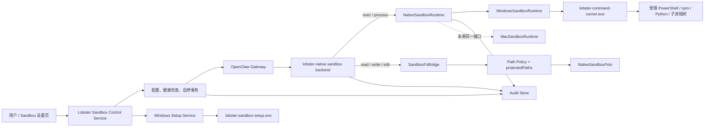
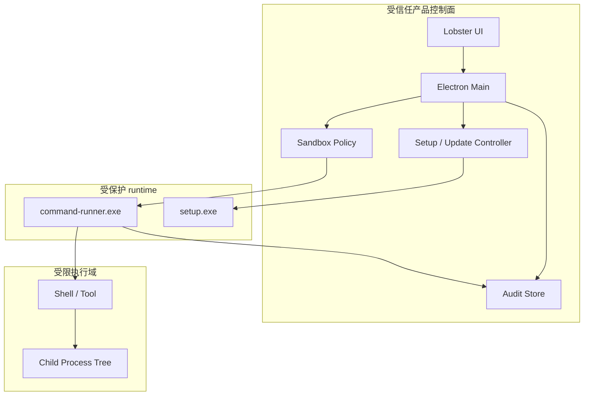

# Lobster 原生沙箱分阶段实施计划

> 文档日期：2026-07-16
>
> 全面修订：2026-07-20
>
> 实施更新：2026-07-21（M2.x 固定权限根方案）
>
> 当前状态：M0、M1、M2 已完成；M2.x 已实施，待端侧验收；Windows 优先，macOS 预留
>
> 适用范围：LobsterAI、内置 OpenClaw runtime、Windows 原生执行后端
>
> 首发目标：Windows x64 内测版

## 1. 文档目的

本文给出 LobsterAI 原生沙箱的完整目标方案、模块边界、迁移策略和分阶段验收计划。

本次修订不再把外部 sandbox runtime 作为核心执行依赖，而是由 LobsterAI 维护一套轻量、可版本化、可签名、可独立升级的原生执行后端。第一版只交付 Windows 能力，但从接口、协议和目录结构上预留 macOS 后端。

方案需要同时满足以下原则：

1. 不依赖 Docker、虚拟机或用户预装的容器环境。
2. 用户可以直接选择已有工程目录，不要求复制工程或新建“特殊权限目录”。
3. 沙箱关闭时，原有实机执行路径和行为保持不变。
4. 沙箱开启后，命令及其子进程的写入范围由操作系统强制限制。
5. OpenClaw 的结构化文件工具与 shell 命令使用同一组由产品声明的固定权限根。
6. 网络默认关闭；后续开放时必须通过显式策略，而不是由命令自行决定。
7. 安装、配置、执行、拒绝、审批和异常均有产品级审计记录。
8. 任一安全组件异常时失败关闭，不自动退回无沙箱实机执行。
9. 不把 Windows 特有机制扩散到 UI、业务配置和 OpenClaw 接入层。
10. 每个 milestone 都可以单独合入、单独回归，不依赖一次性“大爆炸”切换。

## 2. 结论摘要

### 2.1 整体选择

本版采用：

- LobsterAI 自有的 `NativeSandboxRuntime` 平台抽象；
- OpenClaw 自定义 sandbox backend：`lobster-native`；
- Windows 自有 Rust runtime：
  - `lobster-sandbox-setup.exe`
  - `lobster-command-runner.exe`
- workspace 写权限由 Windows restricted token、Capability SID、ACL 和 Job Object 共同约束；
- 结构化文件工具继续走 LobsterAI 的文件桥接和路径策略；
- 网络能力由安装态的 Windows 网络隔离规则控制；
- UI 继续使用设置页中的临时 “Sandbox（测试）” tab；
- macOS 后续通过独立原生后端接入同一平台接口。

### 2.2 Windows Beta 首发版明确保证什么

M3-M5 完成后的 Windows Beta 首发版，其核心安全承诺是：

> 沙箱命令及其子进程只能写入产品明确授权的任务 workspace、Agent workspace、持久 Sandbox Home 和受控临时目录；不能写入其他工程目录、真实用户配置目录或系统目录。

同时保证：

- 进程以受限、非管理员上下文运行；
- 子进程继承相同限制；
- 网络默认不可用；
- 结构化文件操作不能绕过 workspace 边界；
- 路径规范化、符号链接、junction、reparse point 等不能将写入逃逸到 workspace 外；
- 沙箱启动失败、运行时损坏、版本不兼容或健康检查失败时拒绝执行；
- 用户关闭沙箱后恢复原有实机执行行为。

M2/M2.x 只是内部联调版，不满足本节的网络隔离、安装态身份、签名与正式发布承诺；其实际边界以第 19 节和第 19A 节为准。

### 2.3 第一版不承诺什么

`workspace-write` 的首发目标是“严格限制写入”，不是完整虚拟机。

首发版不承诺：

- 对所有 workspace 外文件实现内核级禁止读取；
- 隐藏宿主机的所有进程、注册表、设备或系统信息；
- 对管理员或已经控制宿主机的恶意用户提供隔离；
- 对未经过 LobsterAI/OpenClaw 执行链路启动的进程进行保护；
- 记录所有内核文件 I/O；
- 自动理解任意命令的业务风险并替用户作出审批决定；
- 沙箱 Electron renderer、OpenClaw gateway、浏览器或独立 MCP 服务本身。

因此产品文案必须把首发能力描述为“受限执行与 workspace 写保护”，不能宣传成虚拟机级隔离。

### 2.4 多 workspace 的目标变化

为降低首版实现和长期维护复杂度，后续多 workspace 采用“产品明确声明、运行期可形成权限并集”的折中方向：

- `agentWorkspaceDir`、`taskWorkspaceDir`、Sandbox Home 和只读 Skills 仍分别建模；
- M2.x 仍只允许一个活动的用户工程 workspace；
- 后续允许多个用户工程并发时，可以把当前启用任务涉及的 workspace 合成可见、可审计的授权并集；
- 并集内的任务不承诺彼此形成强隔离，但任何命令仍不得写出产品声明的并集；
- 结构化文件桥继续按当前任务上下文做更窄的路径判断，不能把 OS 层权限并集当作默认文件工具范围；
- 权限并集的内容、增加、移除和异常恢复必须可诊断、可审计。

这是明确的安全性与可维护性取舍：首版优先保证“不能写到 Lobster 未授权的目录”，不把“两个同时运行的已授权工程彼此隔离”作为阻塞目标。

## 3. 用户诉求与典型场景

### 3.1 用户诉求

用户希望在公司内部推广 LobsterAI，但不能接受 Agent 直接继承登录用户的全部文件和网络权限。

从用户角度，核心诉求可以拆为：

1. **原工程可直接使用**：选择现有 Git 工程后即可打开沙箱，不需要迁移文件或改变目录所有权。

2. **workspace 内正常工作**：Agent 可以编辑源码、创建文件、安装项目依赖、运行测试和构建命令。

3. **workspace 外不能随意修改**：即使命令使用绝对路径、PowerShell、Python、Node.js 或启动子进程，也不能改写其他目录。

4. **网络默认不可用**：项目测试、脚本或恶意命令不能自行上传文件、下载任意内容或连接内网服务。

5. **失败不降级**：用户选择沙箱后，如果沙箱不可用，应看到明确错误，而不是任务悄悄改为实机执行。

6. **行为可追溯**：管理员和用户可以知道何时开启沙箱、执行了什么类型的操作、什么被拒绝、最终是否成功。

7. **安装成本可控**：应用安装包内自带所需 runtime；仅在首次安装或修复系统级规则时请求一次 Windows 管理员授权。

### 3.2 示例：允许的操作

假设用户选择：

```text
D:\projects\demo-app
```

沙箱应允许：

- 修改 `D:\projects\demo-app\src\App.tsx`；
- 创建 `D:\projects\demo-app\dist\`；
- 在该目录运行 `npm test`；
- `npm test` 启动的 Node.js 子进程写测试缓存；
- 编译器写入项目内的 `node_modules/.cache`；
- 在受控临时目录生成中间文件；
- 通过结构化文件工具读取和修改项目内文件。

### 3.3 示例：必须拒绝的操作

同一任务应拒绝：

- `Set-Content C:\Users\<user>\Desktop\secret.txt ...`；
- 修改未出现在当前产品授权集合中的另一个工程 `D:\projects\finance-app`；
- 通过 `..\..\`、junction 或符号链接逃逸；
- 先启动 PowerShell，再由 PowerShell 启动 Python 改写 workspace 外文件；
- 修改 LobsterAI 的安装目录或 sandbox runtime；
- 修改受保护的 agent 配置和安全策略；
- 连接公网、局域网或 loopback 上未授权的服务；
- runtime 异常后改为无沙箱执行。

### 3.4 示例：两个任务并发

```text
任务 A -> D:\projects\frontend
任务 B -> D:\projects\backend
```

预期：

- 产品明确展示活动授权并集包含 `frontend` 和 `backend`；
- A/B 均可正常写各自工程；若 shell 获得并集能力，则不承诺 A 与 B 彼此强隔离；
- A/B 均不能写未授权的第三个工程；
- 两个任务都可以读取其运行所需的系统程序和依赖；
- 一个任务结束后，其 Capability 引用被回收或进入可审计的缓存生命周期；
- 两个任务的审计记录可分别归属到对应 session、agent 和 workspace。

## 4. 术语与目录语义

### 4.1 `agentWorkspaceDir`

`agentWorkspaceDir` 是 OpenClaw agent 的内部工作目录，用于 agent 指令、身份、记忆及运行所需的内部文件。

它不是用户当前打开的工程目录。

安全策略中应把它作为单独的、由产品管理的根目录：

- 默认只授权任务所需的最小读写范围；
- 不因某个 agent 曾使用多个工程，就自动合并所有工程权限；
- 其受保护子路径可以比普通工程更严格。

### 4.2 `taskWorkspaceDir`

`taskWorkspaceDir` 是用户当前 session 的工作目录，也就是命令的 `cwd` 和用户期望 Agent 操作的工程根目录。

在首发 `workspace-write` 模式下，它通常是任务最主要的可写根目录。

### 4.3 `cwd`

`cwd` 是某一次命令的启动目录。

要求：

- `cwd` 必须位于本次命令允许的根目录内；
- `cwd` 不是权限边界本身；
- 命令即使从合法 `cwd` 启动，也不能写入未授权绝对路径；
- 切换目录不能扩展 Capability。

### 4.4 `protectedPaths`

`protectedPaths` 是即使位于可写 workspace 内，也需要禁止或限制写入的路径集合。

候选示例：

- sandbox 状态和安全配置；
- agent 管理文件；
- runtime 安装目录；
- Git hooks 或其他可造成持久化执行的敏感入口。

具体默认清单必须通过兼容性测试确定，不能一次性禁止整个 `.git` 等正常开发所需目录。

### 4.5 `scratchDir`

`scratchDir` 是每个 sandbox task 独立的临时可写目录，用于：

- 临时文件；
- shell 重定向；
- 编译或工具链中间文件；
- TEMP/TMP 等临时环境变量的受控映射。

任务结束后按策略清理；异常退出时由恢复流程回收。

### 4.6 `sandboxHomeDir`

`sandboxHomeDir` 是由 LobsterAI 创建并持久化的每 Agent 沙箱用户目录，用于工具缓存、用户级配置以及需要跨任务保留的轻量状态。

Windows M2.x 将以下环境变量映射到该目录，而不暴露真实用户目录：

- `HOME`、`USERPROFILE`、`HOMEDRIVE`、`HOMEPATH` -> `sandboxHomeDir` 对应语义
- `APPDATA` -> `sandboxHomeDir/AppData/Roaming`
- `LOCALAPPDATA` -> `sandboxHomeDir/AppData/Local`

`TEMP`、`TMP` 仍指向可丢弃的 `scratchDir`。Sandbox Home 是明确的可写根，但不加入命令搜索路径，也不等同于 LobsterAI 的真实 `userData`。

### 4.7 LobsterAI 全局 Skills 根

真实 LobsterAI `userData/SKILLs` 在 M2.x 中作为显式只读根：

- OpenClaw 和结构化文件工具可以读取已安装 Skill；
- runner 为该根生成只读 Capability，子进程不能在其中创建、修改或删除文件；
- 通过市场、GitHub 或 ZIP 的宿主侧安装流程仍由 Electron main/`SkillManager` 完成，不经过沙箱命令；
- “通过对话直接创建或改写全局 Skill”暂不支持，这是当前阶段接受的功能损失。

## 5. 已有实现基线与迁移判断

当前分支已经完成了一部分产品层和 OpenClaw 集成层工作。本次是执行后端重规划，不应推倒重来。

### 5.1 继续保留

以下能力原则上保留并改为平台中性命名：

- 设置页 Sandbox（测试）tab；
- Electron main/preload/renderer 的 IPC 边界；
- sandbox 配置存储、状态查询和健康检查入口；
- OpenClaw config 同步；
- 自定义 OpenClaw sandbox backend 接入点；
- `agentWorkspaceDir` / `taskWorkspaceDir` 语义；
- Windows 路径规范化和根目录策略；
- `SandboxFsBridge` 及结构化文件操作入口；
- 启用、关闭、重启 gateway、失败回滚的事务框架；
- 状态、错误码、审计事件和 UI 展示的大部分数据模型；
- 已有单元测试和集成测试中不依赖旧 runtime 的部分。

### 5.2 需要替换或重命名

以下部分改为 Lobster 原生实现：

- 旧外部 runtime 的初始化、session 和命令执行适配；
- 旧 helper 的安装、版本检测和资源打包；
- runtime 专有的文件 I/O adapter；
- backend 和 extension 中带有旧 runtime 含义的命名；
- 旧 runtime 依赖、资源、版本常量和修复脚本；
- 不可见、不可回收且无法审计的长期 session workspace 权限并集逻辑。

典型迁移命名：

| 旧职责/名称 | 新职责/名称 |
| --- | --- |
| `srtWindowsRuntime.ts` | `windowsSandboxRuntime.ts` |
| `srtWindowsSession.ts` | `windowsSandboxSession.ts` |
| runtime 专有 FsIo | `nativeSandboxFsIo.ts` 或 runner-backed FsIo |
| `lobster-srt` backend | `lobster-native` backend |
| runtime 专有 extension 目录 | `lobster-native-sandbox` extension |

最终命名以代码实际边界为准，迁移时不做无关的大范围重命名。

### 5.3 旧阶段与新阶段的映射

| 既有成果 | 本次处理 |
| --- | --- |
| 原 M1：设置、诊断、配置骨架 | 保留，吸收到新 M0/M2 |
| 原 M1.4：代码拆分重构 | 保留，继续按领域目录维护 |
| 原 M2：workspace 语义、路径策略、文件桥接、backend 骨架 | 保留，吸收到新 M0/M2 |
| 原 M3：启停事务、命令接入、边界探测 | 产品层保留；执行 runtime 部分由新 M1/M2 替换 |
| 原 M4/M5 | 取消原定义，改由新 M3-M5 覆盖 |

当前已有代码可以降低产品集成工作量，但不能视为新的 Windows 原生安全后端已经完成。

## 6. 目标架构

### 6.1 总体架构图



### 6.2 信任边界



关键约束：

- LLM 和命令不能直接调用 `setup.exe`；
- `setup.exe` 不执行任何模型生成的命令；
- `command-runner.exe` 不接受“关闭限制”之类的请求参数；
- runtime 安装目录对普通用户和 sandbox token 不可写；
- Electron main 负责策略，runner 负责操作系统级执行；
- renderer 只通过 IPC 使用受控 API，不接触 helper 路径、凭据或系统策略。

## 7. 策略层、执行层、审批层和审计层

“沙箱”不是单一的命令拒绝函数，也不等同于 Docker。完整方案分四层。

### 7.1 策略层

决定本次操作应获得什么能力：

- 可写根目录；
- 可读根目录提示和产品层限制；
- `cwd`；
- `protectedPaths`；
- scratch 目录；
- 网络模式；
- 环境变量；
- 超时、最大进程数和资源限制；
- session、agent、task、workspace 归属。

策略层产生不可变的 `SandboxPolicySnapshot`，执行过程中不得由子进程修改。

### 7.2 执行层

把策略变成操作系统强制约束：

- restricted token；
- Capability SID；
- ACL；
- Job Object；
- 独立进程树；
- 网络隔离规则；
- 受控环境变量和临时目录；
- runtime 安装目录保护。

即使 PowerShell、npm 或 Python 尝试绕过产品判断，操作系统仍拒绝越界写入。

### 7.3 审批层

审批回答的是“这次是否允许扩权”，不是沙箱本身。

首发测试版建议：

- 不提供运行中临时扩权；
- workspace 外写入直接拒绝；
- 网络直接拒绝；
- 需要新 workspace 时，由用户回到产品 UI 明确修改任务目录或配置；
- 不让 LLM 自己将失败操作改为实机重试。

后续如增加审批，也只能生成新的策略快照并重新启动受限命令，不能修改正在运行的 token。

### 7.4 审计层

审计记录产品可观察的安全事件，例如：

- runtime 安装、修复、升级和卸载；
- 用户开启或关闭 sandbox；
- 策略快照的摘要；
- 命令启动、结束、超时和取消；
- 结构化文件读写；
- workspace 越界拒绝；
- 网络拒绝；
- runtime 校验失败；
- gateway 配置同步和回滚；
- 用户审批或配置变更。

审计不等于录制屏幕，也不等于记录所有内核 I/O。

## 8. Windows 原生安全模型

### 8.1 受限 token

`lobster-command-runner.exe` 为每次命令创建受限 token，最低要求包括：

- 移除管理员和高权限 SID；
- 禁用不需要的 privileges；
- 使用 `WRITE_RESTRICTED` 写限制；
- 添加本次命令的 workspace Capability SID；
- 不继承调用者的管理员能力；
- 不允许子进程创建脱离 Job Object 的无限制进程；
- 明确设置安全的环境变量和工作目录。

restricted token 的作用是降低进程身份权限；它与 Capability/ACL 一起决定可写范围。

### 8.2 每个可写根目录的 Capability SID

每个规范化的可写根目录对应稳定、可重建的 Capability 标识。

示意：

```text
workspace canonical path
  -> policy identity + path hash
  -> Capability SID
  -> root ACL grant
  -> command restricted token
```

同一个命令只携带其策略声明的 Capability SID。

这样可以避免：

- 依赖“目录权限必须足够小”；
- 因目录原本授予 `Users` 或 `Authenticated Users` 而初始化失败；
- 多任务共享一个长期 session 后形成不可见、不可回收的权限并集。

ACL 变更必须：

- 幂等；
- 可审计；
- 可恢复；
- 不夺取用户文件所有权；
- 不删除用户已有 ACL；
- 不因卸载破坏原工程权限；
- 对 junction/reparse point 使用明确规则。

### 8.3 Job Object 和进程树

所有命令及子进程进入 Job Object，至少控制：

- 子进程继承；
- 整棵进程树取消；
- 最大进程数；
- runtime 退出后的清理；
- 防止明显的 breakaway；
- 超时和异常回收。

PowerShell、cmd、Node.js、Python、npm、编译器和测试 runner 都必须在同一限制域内。

### 8.4 网络隔离

首发网络模式：

```text
network = disabled
```

目标是对受限身份实施系统级默认拒绝，而不是只删除代理环境变量。

需要覆盖：

- 域名访问；
- 直接 IP；
- DNS；
- HTTP/HTTPS；
- TCP/UDP；
- loopback；
- 局域网和私有地址；
- 子进程；
- PowerShell、curl、Node.js、Python 等不同客户端。

后续如支持网络，应采用显式策略：

```text
disabled
managed-proxy
allowlist
```

首发不支持“任意联网但弹一次确认”。

### 8.5 读取边界

Windows `workspace-write` 首发版主要强制写边界。

需要明确：

- 结构化文件工具仍由 Lobster 路径策略限制读取范围；
- M2.x 对声明的 Skills 根建立“可读、不可写”Capability，但这不等同于完整读取隔离；
- shell 命令的系统级读取隔离弱于写入隔离；
- runner 可以通过受限身份、环境清理和已知敏感路径拒绝降低读取面；
- 只有完成额外的强读取隔离设计和测试后，产品才能提供 `workspace-readwrite` 强隐私模式。

因此 UI 和文档不能把第一版描述成“workspace 外完全不可见”。

### 8.6 路径与链接安全

每次文件操作和命令授权至少检查：

- 绝对路径；
- 盘符大小写和 UNC 形式；
- `.` / `..`；
- 短文件名；
- junction；
- symbolic link；
- hard link；
- reparse point；
- workspace 根目录在检查后被替换；
- TOCTOU；
- 大小写不敏感比较；
- 不同盘符和网络盘；
- 文件不存在时父目录的最终解析。

仅用字符串 `startsWith` 判断路径不满足安全要求。

## 9. 两个 Windows helper 如何维护

### 9.1 源码布局

两个 `.exe` 不作为手工维护的黑盒二进制，而是放在仓库内的同一个 Rust workspace：

```text
native/
  sandbox-windows/
    Cargo.toml
    Cargo.lock
    crates/
      lobster-sandbox-core/
        src/
      lobster-sandbox-protocol/
        src/
      lobster-command-runner/
        src/
      lobster-sandbox-setup/
        src/
    tests/
      fixtures/
      integration/
    README.md
    SECURITY.md
    THIRD_PARTY_NOTICES.md
```

职责：

- `lobster-sandbox-core`
  - SID、token、ACL、Job Object、网络规则和路径安全的共享实现；
- `lobster-sandbox-protocol`
  - 版本化请求、响应、错误码和序列化；
- `lobster-command-runner`
  - 非提权命令执行入口；
- `lobster-sandbox-setup`
  - 需要管理员权限的安装、修复、升级、卸载入口。

两个 binary 的 `main` 应保持轻薄，避免复制安全逻辑。

### 9.2 `lobster-sandbox-setup.exe`

只负责系统级生命周期：

- 安装受保护的 runtime；
- 创建或修复所需本地身份、组和安全对象；
- 安装网络隔离规则；
- 设置 runtime 目录 ACL；
- 写入版本化安装状态；
- 校验当前安装；
- 升级、回滚和卸载；
- 输出机器可读诊断。

约束：

- 只接受固定枚举操作，不接受任意 shell；
- 输入做严格 schema 校验；
- 每次提权操作有明确 UAC 文案；
- 用户取消 UAC 不改变当前有效配置；
- 部分失败可回滚；
- 日志不包含敏感凭据；
- 不从用户可写目录加载 DLL 或执行脚本。

### 9.3 `lobster-command-runner.exe`

只负责每次命令的受限执行：

- 接收版本化 `SpawnRequest`；
- 校验策略和路径；
- 创建 restricted token；
- 绑定 Capability SID；
- 创建 Job Object；
- 配置 stdio 或 ConPTY；
- 启动并监控命令；
- 转发输出、退出码、取消和超时；
- 输出结构化结果与安全事件。

约束：

- 永不申请 UAC；
- 永不创建或修改系统级策略；
- 不接受任意 ACL 配置；
- 不允许请求方传入原始 token 或 SID；
- 不允许通过参数关闭 Job Object、网络隔离或写边界；
- 仅信任受保护安装目录中的配置和签名资源。

### 9.4 构建产物

源码是权威，`.exe` 是 CI 产物。

建议产物结构：

```text
vendor/
  native-sandbox/
    <runtime-version>/
      win32-x64/
        lobster-command-runner.exe
        lobster-sandbox-setup.exe
        manifest.json
        THIRD_PARTY_NOTICES.txt
      win32-arm64/
        ...
```

`manifest.json` 至少包含：

- runtime version；
- protocol version；
- setup schema version；
- target architecture；
- Git commit；
- build timestamp；
- 每个文件的 SHA-256；
- 签名信息；
- 最低 LobsterAI 版本。

禁止开发者手工覆盖已发布 binary。

### 9.5 签名、校验与供应链

发布构建要求：

- CI 使用固定 Rust toolchain；
- `Cargo.lock` 入库；
- 依赖许可和漏洞扫描；
- Windows Authenticode 签名；
- Electron main 启动前检查签名、hash、版本和协议；
- setup 安装前再次校验；
- runner 自检安装目录保护；
- hash 或签名不匹配时失败关闭；
- 构建 provenance 和第三方声明随包发布。

### 9.6 升级与回滚

runtime 与 LobsterAI 应使用兼容矩阵，而不是假定永远同版本。

建议：

```text
LobsterAI version
  -> required runtime range
  -> required protocol version
  -> required setup schema
```

升级流程：

1. 下载或解包新 runtime 到版本目录；
2. 校验签名和 manifest；
3. 运行 setup 的 `upgrade`；
4. 执行健康检查和边界探测；
5. 原子切换 current 版本；
6. 保留上一个可用版本；
7. 失败时恢复旧版本和系统规则。

运行中的任务继续使用启动时锁定的 runtime 版本，不在执行中途热切换。

## 10. 平台中性 runtime 接口

LobsterAI 的控制面和 OpenClaw extension 位于不同进程，不能共享一个内存中的 runtime 对象。实现上因此拆成两个平台中性边界：

```ts
// Electron main：只负责状态、安装和修复，不接收模型生成的命令。
interface NativeSandboxProvisioner {
  getStatus(): Promise<NativeSandboxOperationResult>;
  install(): Promise<NativeSandboxOperationResult>;
  repair(): Promise<NativeSandboxOperationResult>;
}

// OpenClaw extension：只负责受限命令和受控文件 I/O，不执行系统安装。
interface NativeSandboxExecutor {
  getStatus(): NativeSandboxExecutorStatus;
  prepareWorkspace(
    workspaceDir: string,
    policyContext: NativeSandboxPolicyContext,
  ): Promise<void>;
  wrapCommand(request: SandboxCommandRequest): Promise<SandboxWrappedCommand>;
  runIsolatedCommand(request: SandboxCommandRequest): Promise<SandboxCommandResult>;
  createFsIo(request: SandboxFsIoRequest): SandboxFsIo;
  reset(): Promise<void>;
}
```

两个进程通过版本化配置和 gateway 状态协议核对 `backendId`、`runtimeKind`、`runtimeVersion` 与 `protocolVersion`。后续 Windows/macOS 实现分别接入这两个边界，产品控制逻辑和 OpenClaw backend 不直接依赖 SID、ACL、Seatbelt profile 或某个第三方 runtime。

核心数据结构不得出现 Windows SID、ACL 或 macOS profile 等平台字段：

```ts
interface SandboxPolicySnapshot {
  policyVersion: string;
  taskId: string;
  agentId: string;
  cwd: string;
  writableRoots: string[];
  readableRoots: string[];
  protectedPaths: string[];
  sandboxHomeDir: string;
  scratchDir: string;
  networkMode: 'disabled' | 'managed-proxy' | 'allowlist';
  limits: SandboxResourceLimits;
}

interface NativeSandboxPolicyContext {
  agentWorkspaceDir: string;
  sandboxHomeDir: string;
  writableRoots: Array<{ id: string; path: string }>;
  readableRoots: Array<{ id: string; path: string }>;
  protectedPaths: string[];
}
```

平台实现：

```text
NativeSandboxProvisioner / NativeSandboxExecutor
  ├─ Windows native implementation
  └─ macOS native implementation         # 后续
```

Windows 专有类型应停留在：

```text
native/sandbox-windows/
src/main/nativeSandbox/platforms/windows/
scripts/native-sandbox/windows/
```

不得进入 renderer、共享配置或 OpenClaw backend 的公共协议。

## 11. macOS 预留方案

macOS 不复用 Windows `.exe`，只复用产品层和策略层。

后续 `MacSandboxRuntime` 预计负责：

- 将 `SandboxPolicySnapshot` 编译为动态 Seatbelt profile；
- 使用系统原生 sandbox 执行入口启动进程；
- 限制文件读写和网络；
- 管理临时目录和子进程；
- 对 runtime 资源进行签名、打包和版本检查；
- 提供与 Windows 一致的健康检查、错误码和审计事件。

预计可复用：

- 设置 UI；
- IPC；
- 配置存储；
- OpenClaw backend；
- tool call 路由；
- workspace 语义；
- 路径策略的大部分平台中性规则；
- 文件桥接；
- 审计模型；
- 启停事务；
- 失败关闭；
- 主要测试场景定义。

预计必须单独实现：

- 原生执行后端；
- profile 生成；
- macOS 路径解析细节；
- 网络限制；
- 签名、公证和安装；
- 平台逃逸测试。

Windows 首发阶段不实现 macOS runtime，但每个公共接口的评审都必须确认没有绑定 Windows 特有概念。

## 12. OpenClaw 集成方式

### 12.1 自定义 backend

OpenClaw 继续通过自定义 backend `lobster-native` 调用 LobsterAI sandbox extension。

职责边界：

- OpenClaw：
  - 产生 tool call；
  - 管理 agent/session；
  - 把 exec 和文件工具路由到 backend；
- Lobster backend：
  - 解析 task/agent/workspace 上下文；
  - 创建策略快照；
  - 调用 runtime 或文件桥接；
  - 返回标准工具结果；
- 原生 runtime：
  - 执行操作系统级限制；
  - 不理解 LLM、对话或业务审批。

### 12.2 命令 tool call

示例：

```text
LLM 返回 exec tool call
  -> OpenClaw 校验工具参数
  -> lobster-native backend 取得 taskWorkspaceDir/cwd
  -> Lobster Policy Builder 生成 SandboxPolicySnapshot
  -> WindowsSandboxRuntime.spawn()
  -> command-runner 创建受限 token 和 Job Object
  -> 执行 npm test
  -> stdout/stderr/exit code 返回 OpenClaw
  -> UI 展示结果，Audit Store 记录摘要
```

命令参数不需要“翻译成某个第三方 runtime 的参数”。它只转换为 Lobster 自有的 `SpawnRequest`。

### 12.3 结构化文件 tool call

示例：

```text
LLM 返回 write_file tool call
  -> OpenClaw 路由到 lobster-native backend
  -> SandboxFsBridge
  -> 规范化路径并检查 writableRoots/protectedPaths
  -> NativeSandboxFsIo
  -> 成功或返回稳定拒绝错误码
  -> Audit Store 记录文件路径摘要和结果
```

文件操作不能只依赖 OpenClaw 的提示词或前置判断。最终写入必须由受控文件 adapter 完成。

### 12.4 OpenClaw patch 原则

优先把产品策略、runtime 调用、UI 和审计放在 LobsterAI 侧。

只有下列必要行为位于 OpenClaw 内部且没有稳定扩展点时，才保留最小的版本化 patch：

- 为 custom backend 传递 task workspace；
- 让 exec 和结构化文件工具进入同一 backend；
- 保持 agent workspace 与 task workspace 的独立语义；
- 返回稳定的 sandbox 错误信息。

patch 必须：

- 放在当前固定 OpenClaw 版本目录；
- 有自动应用和失败检测；
- 有最小回归测试；
- 不直接包含 Windows 原生安全逻辑；
- OpenClaw 升级时单独复核。

## 13. 配置、状态与用户界面

### 13.1 配置模型

首发 UI 仍只展示一个简单开关，但内部配置应可扩展：

```json
{
  "enabled": false,
  "mode": "workspace-write",
  "networkMode": "disabled",
  "runtime": "native",
  "policyVersion": 1
}
```

产品测试期不向用户暴露所有高级字段。

### 13.2 状态模型

设置页至少展示：

- 平台是否支持；
- runtime 是否安装；
- runtime 版本；
- protocol 是否兼容；
- 安装目录是否健康；
- 系统规则是否健康；
- OpenClaw backend 是否启用；
- 当前产品模式；
- 最近检测时间；
- 最近错误；
- 安装、修复或刷新按钮；
- Sandbox 开关。

### 13.3 开启事务

开启 Sandbox 必须按顺序：

1. 校验平台；
2. 校验 binary 签名、hash 和协议；
3. 安装或修复系统组件；
4. 运行 runtime 自检；
5. 对当前 workspace 生成并验证策略；
6. 运行边界探测；
7. 写入产品配置；
8. 同步 OpenClaw 配置；
9. 重启或热更新 gateway；
10. 验证 backend 生效；
11. 标记开关已启用。

任一步失败：

- 保持或恢复 `enabled = false`；
- 回滚 OpenClaw 配置；
- 不切换为实机执行；
- 在 UI 展示用户可理解的错误；
- 在日志和审计中保留开发诊断码。

### 13.4 关闭事务

关闭 Sandbox：

1. 阻止新 sandbox task 创建；
2. 明确处理正在运行的任务；
3. 写入关闭配置；
4. 同步 OpenClaw；
5. 验证恢复原实机 backend；
6. 清理临时授权和 scratch；
7. 保留 runtime 安装，避免下次重复 UAC；
8. 记录审计。

## 14. 审计设计

### 14.1 事件模型

建议统一事件：

```ts
interface SandboxAuditEvent {
  eventVersion: number;
  eventId: string;
  timestamp: string;
  eventType: SandboxAuditEventType;
  actor: 'user' | 'system' | 'agent';
  sessionId?: string;
  taskId?: string;
  agentId?: string;
  workspaceId?: string;
  policyHash?: string;
  operation?: string;
  targetHash?: string;
  result: 'allowed' | 'denied' | 'failed' | 'completed';
  errorCode?: string;
  durationMs?: number;
  runtimeVersion?: string;
}
```

事件类型至少包括：

- `sandbox.config.changed`
- `sandbox.runtime.install.started`
- `sandbox.runtime.install.completed`
- `sandbox.runtime.verify.failed`
- `sandbox.enabled`
- `sandbox.disabled`
- `sandbox.command.started`
- `sandbox.command.completed`
- `sandbox.command.denied`
- `sandbox.file.allowed`
- `sandbox.file.denied`
- `sandbox.network.denied`
- `sandbox.policy.generated`
- `sandbox.backend.rollback`

### 14.2 隐私与保留

默认不记录：

- 完整文件内容；
- 完整环境变量；
- 凭据；
- token；
- 完整命令输出；
- 用户目录中可能含个人信息的绝对路径明文。

可记录：

- 命令类型和脱敏摘要；
- 规范化目标的 hash；
- workspace 内相对路径；
- 退出码；
- 错误码；
- 策略 hash；
- runtime 版本；
- 时间和操作者。

审计存储应支持保留期限、导出和清理，不能无限增长。

## 15. 稳定错误码

UI 文案与底层错误分离。底层使用稳定错误码，示例：

```text
runtime-not-installed
runtime-version-incompatible
runtime-signature-invalid
runtime-initialization-failed
setup-uac-cancelled
setup-partial-failure
workspace-policy-invalid
workspace-acl-prepare-failed
path-outside-workspace
protected-path-denied
network-denied
process-limit-exceeded
process-timeout
backend-verification-failed
gateway-restart-failed
rollback-failed
```

用户看到的是本地化说明和可行动建议，日志中保留错误码、阶段和原始异常。

## 16. 新 Milestone 总览

本次重新编号为 M0-M6。M0-M5 构成 Windows 首发路径，M6 是后续 macOS 扩展。

工作量是 2026-07-20 制订里程碑时的初始估算，误差约为 ±40%，不包含安全团队正式渗透测试排期；已完成阶段的数字不是剩余工作量。

| Milestone | 目标 | 可交付状态 | 当前状态 | 粗估人日 | 是否阻塞 Windows 首发 |
| --- | --- | --- | --- | ---: | --- |
| M0 | 架构转向与中性边界 | 沙箱关闭时完全回归，旧后端不再扩展 | 已完成 | 3-5 | 是 |
| M1 | Windows runner 技术原型 | CLI 可证明进程树和 workspace 写边界 | 已完成；生产级安全加固归 M3 | 10-18 | 是 |
| M2 | 单 workspace 内部联调版 | 内部测试用户可在已有工程中验证真实任务的写边界 | 已完成 | 7-12 | 是 |
| M2.x | 固定产品权限根兼容层 | Agent 记忆、缓存和已安装 Skills 可在沙箱任务中按声明权限工作 | 已实施，待端侧验收 | 5-9 | 是 |
| M3 | 安装态与系统安全加固 | setup、网络、签名、修复和失败关闭完整 | 未开始 | 12-22 | 是 |
| M4 | 多 workspace 权限并集、审计与企业能力 | 并发工程可用，授权并集和关键事件可追溯 | 未开始 | 5-10 | 是 |
| M5 | 打包、升级、回滚与发布门禁 | 可随 Windows 安装包发布的 Beta | 未开始 | 10-18 | 是 |
| M6 | macOS 原生后端 | 与 Windows 使用同一产品接口 | 后续规划 | 15-30 | 否 |

M2.x 端侧验收通过后，Windows M3-M5 剩余总量粗估：

- 30-55 人日；
- 新增或重写生产代码约 6k-13k 行；
- 新增安全及集成测试约 3k-6k 行；
- 单人串行约 6-11 周；
- 2-3 人按“原生 runtime / Lobster 集成 / 测试发布”拆分，可缩短日历时间，但 M1 安全原型和 M3 系统加固不宜强行并行。

行数只用于量级评估，不作为交付目标。

## 17. M0：架构转向与中性边界

### 17.1 目标

把当前已完成的产品层从旧 runtime 语义中解耦，为 Windows 自有 runtime 建立稳定边界，同时确保默认关闭时不影响原有功能。

### 17.2 主要工作

1. 引入平台中性类型：
   - `NativeSandboxProvisioner`
   - `NativeSandboxExecutor`
   - `NativeSandboxPolicySnapshot`
   - `NativeSandboxRuntimeCapabilities`
   - `NativeSandboxRuntimeDescriptor`
2. 把现有 control service 依赖改为 `NativeSandboxProvisioner` 接口注入。
3. 把 OpenClaw backend 的命令执行依赖改为 `NativeSandboxExecutor` 接口注入。
4. 将 backend/plugin 标识迁移为 `lobster-native` / `lobster-native-sandbox`。
5. 统一 runtime kind、协议版本、状态、错误码和审计常量。
6. 将旧 runtime 的 provisioner、executor 和文件 I/O 收到 `legacy/`，不再增加功能。
7. 为 Windows/macOS 预留 runtime kind、策略快照和版本协议入口；平台实现从 M1 开始进入独立目录。
8. 保证 Sandbox 关闭时仍走原有 OpenClaw 实机路径。
9. 对升级前已保存的 `enabled=true` 做失败关闭迁移：启动时强制改回关闭并同步实机配置。
10. 使用 mock provisioner/executor 覆盖不启动原生 helper 的启用、失败、回滚和 backend 测试。
11. 更新设计文档、威胁模型和迁移清单。

### 17.3 不包含

- 真正的 Windows restricted token；
- setup.exe；
- 系统级网络隔离；
- 对用户开放可用 Sandbox。

### 17.4 验收

- `npm test` 相关覆盖通过；
- `npm run compile:electron` 通过；
- 变更 TypeScript 文件 lint 通过；
- Sandbox 关闭时：
  - 会话创建正常；
  - 文件编辑正常；
  - shell 命令正常；
  - OpenClaw gateway 启动、修复、重启正常；
  - IM、定时任务等不相关路径无变化；
- mock runtime 可以验证启用事务的成功、失败和回滚；
- 代码中新增的公共配置和 UI 不含 Windows SID/ACL 概念；
- 旧 runtime 未被删除，便于 M1/M2 期间对照和回滚，但不再作为目标架构。

### 17.5 完成门禁

M0 可以独立提交。此时设置页开关可以保持不可用或仅限开发开关，不宣传 Sandbox 已可用。

### 17.6 本次实施结果

截至 2026-07-20：

- 产品开关、安装和修复入口保持不可用，不会调用旧 runtime 完成激活；
- OpenClaw 生成配置在 M0 固定为 sandbox off，历史启用状态会安全回落为关闭；
- 原有实现仅作为 `legacy` 诊断/对照适配器保留，未删除依赖和打包资源；
- `lobster-native-sandbox` 已建立独立的 provisioner/executor、协议版本和 backend 身份边界；
- 在 M0 提交点尚未实现 restricted token、Capability SID、ACL、Job Object、原生 runner 或网络隔离；其后的 M1 实施结果见 18.6。

## 18. M1：Windows runner 技术原型

### 18.1 目标

在脱离 Lobster UI 的 CLI 测试环境中，证明 Windows 自有 runtime 能对已有工程目录实施可靠的进程树写限制。

### 18.2 主要工作

1. 创建 `native/sandbox-windows` Rust workspace。
2. 实现版本化 protocol crate。
3. 实现 `lobster-command-runner.exe` 原型。
4. 创建 restricted token：
   - 移除高权限 SID；
   - 禁用 privileges；
   - 使用 `WRITE_RESTRICTED`；
   - 绑定 workspace Capability SID。
5. 实现 workspace Capability 的生成和 ACL 准备。
6. 实现 Job Object、取消、超时和子进程回收。
7. 实现 stdio 流和退出码。
8. 实现 scratch 目录与环境清理。
9. 实现路径规范化和初版 reparse point 规则。
10. 建立 PowerShell、cmd、Node.js、Python、npm 测试矩阵。
11. 建立独立 CLI harness 和安全边界测试。

### 18.3 不包含

- 产品设置页正式开关；
- 完整 setup.exe；
- 发布签名；
- 多任务并发授权生命周期；
- macOS；
- 企业审计 UI。

### 18.4 验收

在一个普通、已存在的 Git 工程上：

- 无需新建特殊目录；
- 可以创建、修改和删除 workspace 内测试文件；
- 可以运行 `npm test`；
- 子进程可以写 workspace；
- 当前用户本人仍可正常使用原工程；
- 不能写另一个工程；
- 不能写 Desktop、Documents、应用安装目录和系统目录；
- PowerShell -> Python -> 子进程链仍不能越界；
- 使用绝对路径、`..`、junction、symbolic link 的越界写入被拒绝；
- 超时或取消能终止完整进程树；
- runner 崩溃后不留下无限制子进程；
- 原工程已有宽 ACL 时仍能建立本次写限制；
- ACL 准备不会删除用户原有权限，也不改变所有者；
- CLI 测试输出稳定错误码。

### 18.5 完成门禁

M1 只证明核心技术可行，不接入用户开关。若 M1 不能稳定阻止子进程和宽 ACL 场景的越界写入，不进入 M2。

### 18.6 本次实施结果

截至 2026-07-20：

- 已建立 `native/sandbox-windows` Rust workspace，按 protocol、core 和 runner 三个 crate 维护；
- 已实现版本化 JSON 请求、稳定错误码、`verify`、`run`、`cleanup` CLI；
- 已实现规范化路径校验、策略根 reparse point 拒绝、稳定 Capability SID、增量 ACL、owner 保持校验；
- 已实现 `DISABLE_MAX_PRIVILEGE | LUA_TOKEN | WRITE_RESTRICTED` restricted token，并保留 PowerShell 启动所需的最小兼容 SID；
- 已实现 suspended spawn、Job Object 先绑定后恢复、最大进程数、超时、Ctrl+C 取消、输出上限和进程树回收；
- 已实现独立 scratch/profile 环境与继承环境收敛；
- 已保留非 Windows 平台入口；当前明确返回 `unsupported-platform`，后续 macOS 后端可复用同一协议而不改调用方契约；
- 自动化边界测试已覆盖已有目录、workspace 内写入、另一个宽 `Users`/`Authenticated Users` ACL 目录拒写、PowerShell → cmd 子进程链、Node.js、Python、npm、junction、protected path 和超时回收；
- 产品开关、Electron/OpenClaw 接入和网络隔离仍保持关闭，符合 M1 独立原型范围。

当前原型仍从登录用户 token 派生。为兼容 Windows PowerShell CLR 初始化，token 需要携带 logon SID 和 `Everyone` 兼容 SID；因此对“目标对象自身显式授予 `Everyone` 写权限”的极端 ACL 不能作为生产级强边界。M2 可以继续验证产品接入，但在对外宣称严格 workspace-only 之前，必须由安装态提供专用低权限 sandbox identity，使“原身份检查 + Capability 检查”同时成立；完整安装、修复、升级和网络规则仍归 M3。

## 19. M2：单 workspace 内部联调版

### 19.1 目标

把 M1 runner 接入当前 LobsterAI 与 OpenClaw，让内部测试用户可以在已有工程中开启 Sandbox，验证常见任务的 workspace 写边界和产品工作流。M2 不宣称读取隔离、网络隔离或生产就绪。

### 19.2 主要工作

1. 实现 `WindowsSandboxRuntime` 的状态探测和开发态路径解析。
2. Electron main 仅负责 runtime 状态、启停编排和 OpenClaw 配置同步；模型命令不经过 Electron main 执行。
3. 将 OpenClaw backend 的正常执行路径从 legacy adapter 切换为 `lobster-native` 原生 executor。
4. 接通 exec tool call，并处理命令输出、runner 报告、超时、取消和临时请求文件。
5. 接通 `SandboxFsBridge` 和经原生 executor 执行的 FsIo；产品路径不得以 OpenClaw 宿主身份直接完成最终文件写入。
6. 为每个 task 生成：
   - `agentWorkspaceDir`
   - `taskWorkspaceDir`
   - `cwd`
   - `writableRoots`
   - `readableRoots`
   - `protectedPaths`
   - `sandboxHomeDir`
   - `scratchDir`
   - `networkMode`
   M2 的 `protectedPaths` 和 `networkMode` 仅保留协议字段：前者暂为空，后者即使声明 `disabled` 也不代表已建立系统级网络边界。
7. 完成开关启用、关闭、gateway 同步和回滚。
8. 增加启用前边界探测：
   - workspace 内写入成功；
   - workspace 外写入失败；
   - runtime 明确报告网络和读取未隔离。
   子进程继承、junction 和常见开发工具的边界继续由 M1 Rust 自动化回归覆盖，不在每次启用时重复执行。
9. 设置页展示 runtime、backend、健康状态和最近错误。
10. 增加开发包内 runner 打包。
11. 将旧 runtime 路径从正常产品选择中移除。

### 19.3 首版限制

- 同一时刻只支持一个用户工程 workspace；切换工程前需要结束任务并重新初始化；
- 网络不隔离，沿用宿主机可用网络；
- 只验证写边界，不宣传完整读取隔离；
- 仅 Windows x64 开发/内测环境；
- 仅通过 Sandbox（测试）入口开放，并明确展示上述限制；
- UI 不提供安装或修复；开发构建直接使用随源码编译的 runner，尚未达到正式发布质量；
- M2 不支持向沙箱命令转发非空 stdin，依赖交互输入的命令会明确失败。

### 19.4 用户验收

用户从设置页：

1. 选择一个已有工程；
2. 点击启用 Sandbox；
3. 创建新会话；
4. 让 Agent 修改一个源文件；
5. 让 Agent 新建文件；
6. 让 Agent 运行 `npm test`；
7. 分别通过文件工具、PowerShell 和子进程让 Agent 尝试写 workspace 外文件；
8. 确认设置页明确提示网络和读取尚未隔离；
9. 关闭 Sandbox；
10. 再创建会话确认恢复原实机行为。

预期：

- 前 6 步正常；
- 文件工具、shell 和子进程的越界写被明确拒绝；
- 联网不作为 M2 的拒绝项，UI 不得暗示网络已隔离；
- UI 展示可理解的失败原因；
- 日志有开发错误码；
- 不出现静默降级；
- 关闭后原有行为正常；
- 不要求用户迁移工程或创建子目录。

### 19.5 技术验收

- OpenClaw runtime 启动和 config sync 正常；
- task workspace 传递正确；
- exec/file tool 使用同一策略；
- runner 机器报告不混入用户可见 stdout/stderr；
- runtime 报告 `networkIsolated=false`、`readIsolated=false` 和 `productionReady=false` 时，产品仍只以内部测试能力展示；
- renderer/main/preload IPC 类型一致；
- feature flag 关闭时 OpenClaw 保持实机模式且不调用 runner；
- runtime 初始化失败时 gateway 不进入“已启用”状态；
- relevant Vitest、Electron compile 和变更文件 lint 通过。

### 19.6 本次实施结果

截至 2026-07-21，M2 代码已实施，等待端侧验收：

- Electron main 已切换到 Windows 原生 runtime descriptor 和只读状态探测，开发态解析 `native/sandbox-windows/target/release/lobster-command-runner.exe`，打包态解析 `Resources/sandbox-runtime/lobster-command-runner.exe`；
- 设置页开关已接通既有启停事务，并展示“网络未隔离、读取未隔离、尚未达到发布标准”；安装与修复入口在本阶段保持隐藏；
- OpenClaw 配置在用户开启测试开关且平台为 Windows x64 时选择 `lobster-native`；不支持的平台、关闭状态或初始化失败均保持失败关闭，不自动回退到无沙箱执行；
- `lobster-native-sandbox` 正常路径已从 legacy executor 切换到 `WindowsNativeSandboxExecutor`，shell exec 和结构化文件工具均通过同一个 runner 策略执行；
- runner 新增独立机器报告文件，避免协议 JSON 混入用户可见 stdout/stderr；请求、报告和文件工具输入使用每次初始化独立的 scratch 目录，并在完成或重置时清理；
- 初始化会真实验证 workspace 内可写、workspace 外不可写；单进程仅持有一个活动 task workspace，切换工程需关闭 Sandbox 或重启 gateway 后重新初始化；
- 打包配置已包含 Windows runner；M2.x 将协议升级为 v2，版本核验固定为 `lobster-command-runner 0.2.0`；旧 runtime 代码和资源仅为回滚/对照保留，不参与正常执行路径；
- M2 自动验证已覆盖相关 Vitest、Rust workspace、Rust Clippy、Electron TypeScript 编译、Renderer/主进程生产构建、扩展预编译和打包资源核验；真实 runner smoke 已验证 shell 与文件工具均可在 workspace 内写入且不能写到外部目录。M2.x 的最终验证结果以本次变更交付记录为准。

M2 仍沿用 M1 从当前登录用户派生的 restricted token，因此显式向 `Everyone` 授予写权限的目标对象仍是已知生产级缺口；网络、读取、安装态专用身份、签名和防篡改均未实现。这些限制不会在 UI 中被描述为已具备能力，正式安全承诺仍以 M3-M5 为门禁。

## 19A. M2.x：固定产品权限根兼容层

### 19A.1 背景与目标

M2 只授予 `taskWorkspaceDir` 后，真实 LobsterAI 工作流会在读取 Agent 记忆、Skill 和用户级工具配置时失败。直接放开整个 LobsterAI `userData` 虽然兼容性最好，但会使模型命令能够修改应用配置、插件、凭据相关状态和其他 Agent 数据，失去清晰的写边界。

M2.x 采用固定根折中方案：不映射整个真实 AppData，也不为每项功能建立复杂的动态审批；由 LobsterAI 在创建 backend 时声明少量稳定根，并让 shell 与结构化文件工具消费同一策略上下文。

### 19A.2 当前根目录矩阵

| 根目录 | 权限 | 生命周期 | 主要用途 |
| --- | --- | --- | --- |
| `taskWorkspaceDir` | 读写 | 当前活动工程 | 源码、项目依赖、测试和构建产物 |
| `agentWorkspaceDir` | 读写 | Agent 持久 | `AGENTS.md`、`MEMORY.md`、`SOUL.md`、日记忆等 OpenClaw 内部状态 |
| `sandboxHomeDir` | 读写 | 每 Agent 持久 | HOME/AppData 映射、工具缓存和用户级轻量配置 |
| `scratchDir` | 读写 | runtime 临时 | 请求、报告、stdin 暂存和临时文件 |
| LobsterAI `SKILLs` | 只读 | 产品持久 | 读取已安装 Skill |
| 其他真实 LobsterAI `userData` | 不声明写权限 | 产品持久 | 继续由宿主侧功能管理，不向模型命令开放 |

同一访问级别的重复路径会按规范化路径去重；只读根与可写根若相同、互为父子或发生覆盖，则初始化失败，避免只读声明被更宽的写 Capability 抵消。结构化文件桥使用根 ID 和读写属性做词法、canonical path、reparse point、hardlink 与竞态检查；runner 使用对应的读写 Capability SID 和 ACL，使 PowerShell、Node.js、Python、npm 及其子进程不能绕过同一写入范围。

### 19A.3 环境映射与持久化

每个 Agent 的 Home 位于 LobsterAI 管理的数据根下，目录名由 Agent ID 的安全 slug 与 hash 生成；session key 不直接进入路径。因此：

- 同一 Agent 的多个 session 复用同一个 Sandbox Home；
- 不同 Agent 默认使用不同 Home；
- `HOME`、`USERPROFILE`、`APPDATA`、`LOCALAPPDATA` 由 runner 强制设置，tool call 传入的同名环境变量会被过滤；
- `TEMP`、`TMP` 继续映射到 scratch，任务重置后可删除；
- 真实 `%APPDATA%/LobsterAI` 不因环境继承而成为命令的默认用户目录。

### 19A.4 功能兼容性取舍

当前预期：

- Agent 指令、身份、记忆和日记忆可以正常读写，因为 `agentWorkspaceDir` 明确可写；
- 已安装 Skill 可以正常发现和读取；市场、GitHub、ZIP 等宿主侧安装继续可用；
- 通过对话让模型直接写入真实全局 `SKILLs` 会被拒绝，暂不提供 shadow copy 或回写同步；
- AI Skin、插件、MCP、模型配置等若通过现有 Electron IPC/主进程管理流程落盘，仍使用宿主侧权限；若模型命令试图直接写真实 LobsterAI AppData，则不在允许范围内；
- npm、Python 等工具写入用户级缓存时会落到 Sandbox Home，而不是污染真实用户 Home；某些硬编码真实绝对路径的第三方工具仍可能不兼容；
- 一般性的 workspace 外读取尚未由 M2.x 全面隔离，`readIsolated` 继续如实报告为 `false`。

允许整个 `agentWorkspaceDir` 写入会让任务修改 Agent 记忆和指令，这是为维持现有产品行为接受的风险；后续是否拆成更细的可写子路径列入 TBD。

### 19A.5 OpenClaw 与 LobsterAI 接线

不修改 OpenClaw 核心。LobsterAI 配置同步向 `lobster-native-sandbox` extension 传入：

- runner 路径与版本；
- `sandboxDataRoot`；
- 真实 `skillsRoot`。

extension 从 `CreateSandboxBackendParams` 取得 `agentWorkspaceDir`、`taskWorkspaceDir` 和 session key，构造 `NativeSandboxPolicyContext`，再同时传给 executor 和文件桥。runner 协议 v2 新增 `sandboxHomeDir`，并把 `readableRoots` 从“仅声明”升级为真正的只读 Capability。

当前 executor 仍只允许一个活动 `taskWorkspaceDir`。它会登记运行期见过的可写根并在 reset 时按并集撤销 Capability ACE，避免新增 Agent/Home 根后留下授权残留；普通命令仍使用当前 backend 上下文生成 token。

### 19A.6 验收

除 M2 原验收外，M2.x 需要满足：

1. 同一 Agent 的两个 session 获得相同 Sandbox Home，不同 Agent 获得不同 Home。
2. `HOME`/`USERPROFILE` 中写入可跨命令保留，`TEMP`/`TMP` 仍为临时目录。
3. Agent workspace 中的记忆文件可由 shell 和结构化文件工具读取、修改。
4. 已安装 Skill 可读取；shell 和结构化文件工具均不能修改 `SKILLs`。
5. 真实 LobsterAI `userData` 中未声明的目录不能通过写 root 获得权限。
6. 新增根后 reset 请求包含完整可写根并集，ACL 清理不遗漏。
7. UI 明确描述固定根、Skills 只读、网络未隔离和一般读取未隔离。
8. Sandbox 关闭时，Skill、Skin、Agent 记忆和原本实机任务行为无回归。

### 19A.7 明确不包含

- 多个用户工程同时活动；
- 对话创建全局 Skill；
- 真实 LobsterAI AppData 的通配读写授权；
- 按 tool call 动态弹窗扩权；
- 网络隔离、完整读取隔离和生产级身份；
- Sandbox Home 配额、清理 UI、迁移和导出；
- macOS 后端实现。

### 19A.8 本次实施结果

截至 2026-07-21，M2.x 已完成代码接线并等待端侧验收：

- OpenClaw 配置同步新增 `sandboxDataRoot` 和 `skillsRoot`，未修改 OpenClaw 核心；
- extension 新增稳定的每 Agent policy context，并将其同时传递给 exec、shell 和结构化文件工具；
- Windows runner 协议升级到 v2 / `workspace-write-v2`，runtime 版本升级到 `0.2.0`；
- runner 已实现多个读写 Capability、只读 Capability、完整 ACL cleanup，以及 Sandbox Home 与临时目录的分离环境映射；
- 根 Capability identity 跨兼容协议版本保持稳定，避免升级时制造无法由新 runtime 回收的旧 ACE；
- 只读根与可写根重叠时失败关闭；同一 runtime 周期登记过的根会进入 reset 清理并集；
- 设置页测试文案已更新，不再声称“仅 task workspace 可写”，并继续如实展示网络和一般读取未隔离；
- 自动测试覆盖固定根接线、稳定 Agent Home、结构化路径访问级别、Skills 原生只读、PowerShell/Node/Python/npm 子进程边界、持久 Home、ACL 清理并集和真实 runner smoke。

## 20. M3：安装态与系统安全加固

### 20.1 目标

把开发可用的 runner 变成可安全安装、修复和升级的 Windows runtime，并完成网络和供应链加固。

### 20.2 主要工作

1. 实现 `lobster-sandbox-setup.exe`。
2. 定义固定的 setup 操作：
   - install
   - verify
   - repair
   - upgrade
   - rollback
   - uninstall
3. 安装 runtime 到受保护目录。
4. 设置 binary 和配置 ACL。
5. 创建和管理所需本地安全主体。
6. 安装默认拒绝的网络规则。
7. runner 使用安装态安全主体执行。
8. 加固 Job Object、private desktop 或等效桌面隔离。
9. 加固 DLL 搜索路径、PATH、HOME、TEMP 和代理环境。
10. 增加 runtime manifest、hash 和签名检查。
11. 增加系统重启后的健康恢复。
12. 增加 UAC 取消、部分失败和回滚。
13. 增加 tamper 检测和 fail-closed。
14. 完成系统级日志和产品审计衔接。

### 20.3 验收

- 首次启用只在需要安装系统组件时请求 UAC；
- 应用普通启动不自动弹 UAC；
- 用户取消 UAC 后配置保持未启用；
- 安装中途失败可回滚；
- runtime 文件被篡改后拒绝执行；
- 普通用户和 sandbox 进程不能修改 runtime；
- 网络测试覆盖域名、IP、DNS、loopback、局域网、子进程；
- 清空代理变量或自行启动网络客户端不能绕过；
- 受限进程不能使用管理员 token；
- 进程不能明显 break away；
- 应用升级后可以 verify/repair；
- setup 不接受任意命令参数；
- 所有失败均有稳定错误码和用户提示。

### 20.4 安全评审门禁

M3 完成前进行专项代码评审，至少覆盖：

- token/SID；
- ACL；
- reparse point；
- TOCTOU；
- Job Object；
- 网络规则；
- setup 提权入口；
- binary 加载与签名；
- 卸载恢复；
- 敏感日志。

未完成安全评审，不进入企业内测。

## 21. M4：多 workspace 权限并集、审计与企业能力

### 21.1 目标

支持不同 agent/task 并发操作不同工程；允许 Windows runtime 在活动任务之间共享产品明确声明的 workspace 权限并集，以换取更简单、稳定的生命周期管理，同时形成可供用户和管理员追溯的审计闭环。

### 21.2 主要工作

1. 为 workspace 建立稳定 identity 和 Capability 生命周期。
2. 建立活动 workspace 授权并集，并在 UI、状态和审计中明确展示。
3. 支持：
   - 一个 agent 的不同 task 使用不同 workspace；
   - 多个 agent 并发；
   - task 内少量显式多根目录；
   - agent workspace 与 task workspace 分开授权。
4. 增加 Capability 引用计数、并集缓存和回收。
5. 处理崩溃恢复、孤儿授权和目录移动。
6. 完成结构化审计存储。
7. 增加审计查询、导出和保留期。
8. 增加配置变更和审批事件。
9. 增加策略 hash 和 runtime 版本关联。
10. 增加跨 task、跨 agent 的并集边界和越界测试。

### 21.3 验收

给定：

```text
Agent A / Task A -> Workspace A
Agent B / Task B -> Workspace B
```

并发执行时：

- A 可写 A；
- B 可写 B；
- 产品明确显示当前授权并集为 `{Workspace A, Workspace B}`；
- A/B 的命令可能获得并集内的写能力，此行为不宣传为任务间强隔离；
- A/B 及其子进程均不能写入并集外的 Workspace C；
- B 新增 workspace 会形成可追踪的配置/授权变化；
- task 结束后授权生命周期可追踪；
- 已无引用的 workspace 能从并集中移除，崩溃后可恢复或清理；
- 每次命令、文件写入、拒绝和配置变化有可关联审计记录；
- 审计默认不记录文件内容、凭据或完整环境；
- 审计清理不影响 runtime 正常工作。

### 21.4 企业内测门禁

完成并集边界回归、授权生命周期恢复、审计隐私评审和长时间稳定性测试后，才向企业内测用户开放。若企业策略要求任务间强隔离，应禁用并发或等待后续独立 runtime/identity 模式，不在 M4 中隐式承诺。

## 22. M5：打包、升级、回滚与 Windows 发布

### 22.1 目标

把原生 runtime 纳入 LobsterAI 正式 Windows 构建、安装、升级和发布流程。

### 22.2 主要工作

1. CI 构建 Rust runtime。
2. 固定 toolchain 和依赖。
3. 生成 SBOM、manifest 和第三方声明。
4. Authenticode 签名。
5. Electron 打包只包含目标架构产物。
6. 实现 side-by-side runtime 版本。
7. 实现应用/runtime 兼容矩阵。
8. 实现自动 verify、repair、upgrade 和 rollback。
9. 删除旧外部 runtime 的依赖和发布资源。
10. 增加干净安装、覆盖升级、降级、卸载测试。
11. 增加 Windows 版本、文件系统和安全软件兼容矩阵。
12. 完成 Beta 发布说明、限制说明和故障诊断文档。

### 22.3 首发架构

Windows x64 是首发阻塞项。

Windows arm64 可采用：

- 同 milestone 后半段交付；或
- 明确标记为后续增量，不阻塞 x64 Beta。

不得在 arm64 上静默使用 x64 不兼容 runtime。

### 22.4 验收

- 干净机器无需 Docker 或额外开发环境；
- 安装包携带匹配 runtime；
- 首次启用安装成功；
- 从上一 LobsterAI 版本升级成功；
- runtime 升级失败自动回滚；
- 应用降级时给出兼容提示；
- 卸载不破坏用户工程 ACL；
- 卸载可选择保留或删除审计数据；
- 离线安装和运行可用；
- 杀毒软件常见环境完成兼容性验证；
- 安装包签名和 binary 签名可验证；
- 旧 runtime 不再进入生产路径；
- Sandbox 关闭时全量原功能回归通过。

### 22.5 Windows Beta 发布门禁

必须全部满足：

- M0-M4 验收完成；
- 安全专项评审完成；
- 无已知 workspace 写逃逸；
- 无已知网络绕过；
- 无已知静默降级；
- 安装、修复、升级、回滚可恢复；
- 用户文案准确描述能力边界；
- 支持一键收集脱敏诊断。

## 23. M6：macOS 原生后端

### 23.1 目标

在不修改 Lobster UI、OpenClaw backend 和公共策略协议的前提下，新增 macOS 原生执行后端。

### 23.2 主要工作

1. 实现 `MacSandboxRuntime`。
2. 将平台中性策略编译为 macOS profile。
3. 实现文件读写、进程树和网络限制。
4. 实现 macOS scratch 和环境策略。
5. 实现健康检查和边界探测。
6. 接入签名、公证和 app bundle。
7. 建立 macOS 版本与架构测试矩阵。
8. 复用 Windows 定义的用户冒烟场景和审计事件。
9. 验证 Windows 特有配置没有泄漏到共享层。

### 23.3 验收

- 同一 `SandboxPolicySnapshot` 可由 macOS 后端解释；
- workspace 内写入正常；
- workspace 外写入被拒绝；
- 子进程继承；
- 网络默认关闭；
- 设置页、错误码和审计体验与 Windows 基本一致；
- Intel/Apple Silicon 支持范围有明确说明；
- 签名、公证和升级流程通过；
- 无需修改 OpenClaw tool call 协议。

### 23.4 成本说明

预计可复用 65%-75% 的产品和集成代码，但原生安全执行层需要独立开发和安全测试。M6 不应仅按“增加一个平台判断”估算。

## 24. 测试矩阵

### 24.1 原有行为回归

Sandbox 关闭时验证：

- 新建和恢复会话；
- 文件读写；
- shell 命令；
- npm/Python/PowerShell；
- artifact；
- 浏览器；
- MCP；
- IM；
- 定时任务；
- OpenClaw gateway 启动、修复和重启；
- 应用退出、重启和升级。

### 24.2 workspace 内正常行为

- 修改现有文件；
- 新建、删除、重命名；
- 大文件；
- 深层目录；
- Unicode、空格、长路径；
- Git 操作；
- npm install/test/build；
- Python venv/test；
- 编译器和子进程；
- 并发读写；
- 取消和超时。

### 24.3 越界写入

- 绝对路径；
- 相对路径 `..`；
- 其他盘符；
- UNC；
- Desktop/Documents；
- 另一个工程；
- LobsterAI data/install/runtime；
- Windows 系统目录；
- junction；
- symlink；
- hard link；
- reparse point；
- 父目录替换；
- PowerShell/Node/Python 多层子进程；
- 后台进程；
- 脱离终端的进程。

### 24.4 网络

- DNS；
- 域名；
- 直接 IP；
- HTTP/HTTPS；
- TCP/UDP；
- IPv4/IPv6；
- loopback；
- 局域网；
- 私有地址；
- 代理；
- 清除代理变量；
- PowerShell、curl、Node、Python；
- 子进程；
- 长连接。

### 24.5 安装与升级

- 干净安装；
- 非管理员启动；
- UAC 同意/拒绝；
- 安装中断；
- 修复；
- runtime 文件丢失；
- hash 篡改；
- 签名异常；
- 应用升级；
- runtime 升级；
- 回滚；
- 系统重启；
- 卸载；
- 用户工程 ACL 保持。

### 24.6 多 workspace

- 同 agent 串行不同 workspace；
- 同 agent 并发不同 workspace；
- 多 agent 并发；
- workspace 嵌套；
- workspace 移动/删除；
- 多盘符；
- task 结束能力回收；
- 应用崩溃后恢复；
- 当前授权并集的展示、增加、移除和审计；
- shell/子进程只能写入 A/B 并集，不能写入未授权的 C；
- 结构化文件桥仍按当前 task 的显式根拒绝无关路径；
- Agent workspace、task workspace、Sandbox Home 和 Skills 根保持不同语义与访问级别。

## 25. 代码与目录规划

### 25.1 新增

```text
native/sandbox-windows/
src/main/nativeSandbox/platforms/windows/
src/main/nativeSandbox/platforms/macos/        # M6
src/shared/nativeSandbox/
scripts/native-sandbox/
openclaw-extensions/lobster-native-sandbox/
tests/native-sandbox/
```

### 25.2 重点修改

```text
src/main/nativeSandbox/
src/main/libs/openclawConfigSync.ts
src/main/libs/openclawEngineManager.ts
src/main/preload.ts
src/renderer/components/settings/nativeSandbox/
src/renderer/services/i18n.ts
package.json
electron-builder 配置
OpenClaw 版本化 patch 与应用脚本
CI workflow
```

### 25.3 模块边界

建议保持：

```text
src/main/nativeSandbox/
  application/       # control、启停事务、状态
  domain/            # policy、错误码、审计模型
  integration/       # OpenClaw、config sync、FsBridge
  platforms/
    windows/         # Windows runtime adapter
    macos/           # M6
```

现有目录如已采用不同但清晰的二级划分，不为追求目录一致性做无关重构。

## 26. 迁移策略

迁移不一次性删除旧路径：

1. M0 引入中性接口和 mock，旧路径保持默认不可选；
2. M1 独立开发 runner，不影响产品；
3. M2 开发开关选择 `lobster-native`；
4. 内测期间保留明确的 kill switch；
5. M3/M4 完成后停止旧 runtime 打包；
6. M5 发布前删除旧依赖和资源；
7. 保留一版应用级配置迁移：
   - 旧 `enabled` 不自动映射为新 runtime 已启用；
   - 升级后先 verify/install；
   - 成功后由用户明确开启；
8. 旧日志和审计数据仅做只读兼容，不参与新策略判断。

任何阶段都不允许在新 runtime 失败时自动调用旧 runtime 或实机 backend。

## 27. 主要风险与缓解

| 风险 | 影响 | 缓解 |
| --- | --- | --- |
| Windows ACL/token 细节错误 | workspace 逃逸或用户工程受损 | M1 CLI 原型先行、专门安全测试、ACL 只增量不夺权 |
| 子进程 breakaway | 绕过限制 | Job Object、创建标志限制、进程树测试 |
| 网络规则可绕过 | 数据外传或内网访问 | 系统级默认拒绝、多客户端/协议测试 |
| helper 提权面过大 | 本地提权风险 | setup 固定命令、严格 schema、受保护目录、签名 |
| 现有工程兼容性差 | 用户无法启用 | Capability SID 模型、宽 ACL 测试、不要求迁移目录 |
| OpenClaw 升级破坏 backend | 任务无法执行 | 最小版本 patch、自动应用测试、固定版本 |
| 安全文案过度承诺 | 用户错误理解 | 明确 workspace-write 与读取边界 |
| runtime 与应用版本错配 | 初始化失败 | 协议版本、manifest、兼容矩阵、side-by-side |
| 安全软件误报 helper | 安装失败 | 签名、稳定路径、Beta 兼容矩阵、诊断工具 |
| macOS 预留流于形式 | 后续重写产品层 | 公共接口评审、平台中性测试、禁止 Windows 字段泄漏 |

## 28. 待决策项

以下问题不阻塞 M0/M1，但必须在对应 milestone 前确定：

1. Windows runtime 首发是否只支持 x64。
2. 网络隔离采用专用本地身份 + 防火墙，还是更底层的过滤驱动/平台能力。
3. M3 是否引入 private desktop，还是先以 token + Job Object 为首发。
4. 首发 `protectedPaths` 的默认清单。
5. workspace Capability ACL 的缓存和卸载恢复策略。
6. 审计数据保留期、导出格式和企业配置入口。
7. task 内显式多根目录的最大数量。
8. 是否在 M5 Beta 中开放受控网络，当前建议不开放。
9. 强读取隔离是否作为独立模式，而不是扩大 `workspace-write` 的承诺。
10. 是否将 `agentWorkspaceDir` 从整体可写收窄为记忆、身份等明确子目录，以及由谁维护兼容清单。
11. 对话创建 Skill 后续采用宿主侧受控 API、shadow copy + 审批回写，还是继续不支持。
12. Sandbox Home 的配额、清理周期、迁移、备份、导出和“重置 Agent 环境”入口。
13. 多 workspace 权限并集的最大数量、UI 展示方式和 task 结束后的回收宽限期。
14. AI Skin、插件、MCP 等宿主侧写入是否需要统一成可审计的受控产品 API。
15. macOS 后端如何表达同一组固定根和 Sandbox Home 映射，不把 Windows ACL 语义泄漏进公共协议。
16. 是否需要把只读 Skills 拆成每 Skill 根，以减少已安装 Skill 之间的可见性。

## 29. 推荐实施顺序

当前下一步不是继续修补旧 runtime，而是：

1. 完成 M0：
   - 中性接口；
   - backend 命名；
   - mock；
   - 原行为回归；
2. 独立完成 M1 Windows runner 技术验证；
3. 只有 M1 的“宽 ACL + 子进程 + 已有工程”三项同时通过，才接入 M2；
4. M2 先做内部可用，不急于正式打包；
5. M3 完成系统安全和安装态后，再进行安全团队评审；
6. M4 解决多工程并发权限并集、生命周期与审计；
7. M5 才移除旧依赖并进入 Windows Beta；
8. Windows 接口稳定后启动 M6。

该顺序保证每一步都有独立价值：

- M0 证明不破坏现有产品；
- M1 证明安全核心可行；
- M2 证明用户工作流可用；
- M3 证明安装态和系统级防护可靠；
- M4 证明企业多任务权限并集、越界保护与审计成立；
- M5 证明可发布、可升级、可恢复；
- M6 证明平台抽象可扩展。

## 30. 最终验收定义

Windows Beta 被视为完成，必须同时满足：

1. 用户可直接选择已有工程并开启 Sandbox。
2. workspace 内编辑、测试和构建正常。
3. shell 及全部子进程不能越界写入。
4. 结构化文件工具不能绕过相同边界。
5. 多任务并发只形成产品明确声明、用户可见且可审计的 workspace 权限并集，所有子进程不能写出该并集。
6. 网络默认关闭且通过绕过测试。
7. runtime 安装、签名、修复、升级和回滚可用。
8. helper 由仓库源码和 CI 统一维护，不存在手工 binary。
9. 开启失败不会静默退回实机。
10. 关闭 Sandbox 后原有行为无异常。
11. 用户和管理员可以追溯关键安全事件。
12. 产品文案准确说明“写入隔离”与“读取隔离”的差异。
13. OpenClaw 变更保持最小、版本化且可自动验证。
14. macOS 平台接入不需要重写 UI、IPC、配置、backend 和审计模型。
